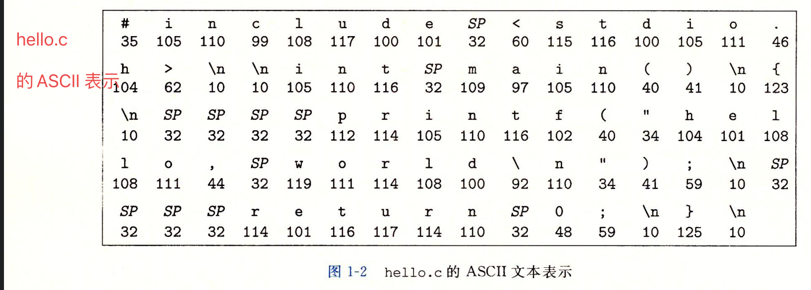
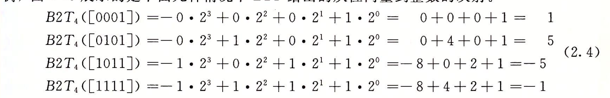
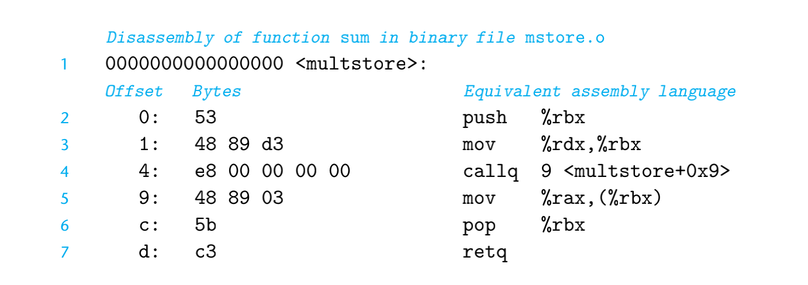
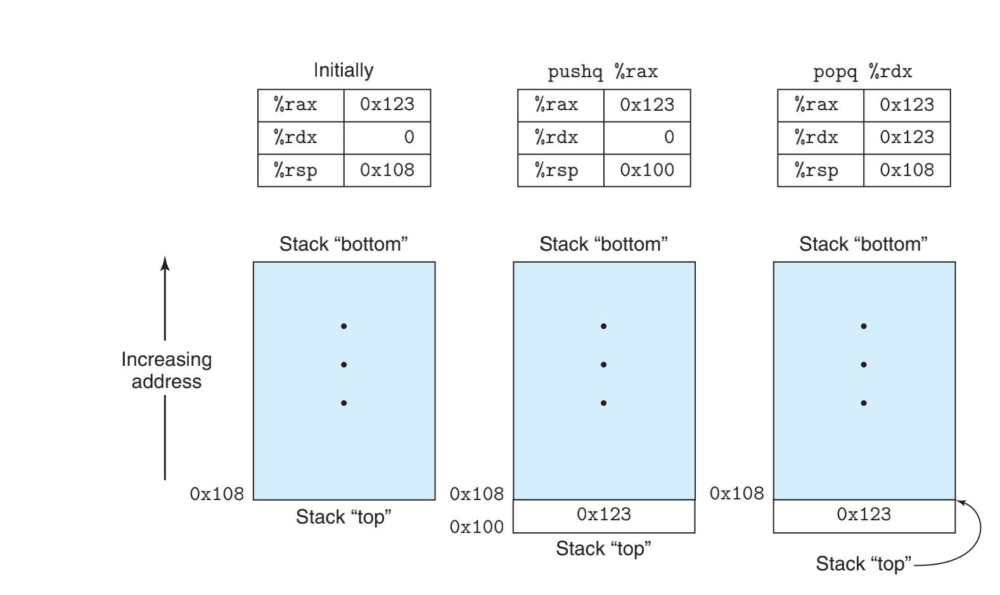

# 1 计算机系统漫游


计算机系统是由硬件和系统软件组成，共同工作来运行应用程序


## 1.1 信息就是 位 + 上下文

> **hello.c**

```c
#include <stdio.h>

int main(){
  printf("hello, world\n");
  return 0;
}
```


源程序实际上是由值为 1 和 0 组成的位序列， 每8个一组 称为字节

* 每个字节表示程序中的某些文本字符


大部分现在计算机系统都使用 ASCII 标准来表示文本字符




> **文本文件**

像 hello.c 这样只由 ASCII 字符构成的文件称为 **文本文件**， 其他所有文件都称为 **二进制文件**


hello.c 表示方法说明一个基本思想，系统中的所有信息 

* 磁盘文件
* 内存中的程序
* 用户数据
* 网络上传送的数据

都是由一串比特表示的。


区分不同数据对象的唯一方法是我们读到这些数据对象时的上下文

* 比如在不同的上下文中， 一个同样的字节序列可能表示一个整数，浮点数，字符串或者机器指令


## 1.2 程序被其他程序翻译成不同的格式

Programs are Translated by Other Programs into Different Forms


在 Unix 系统上，从源文件到目标文件的转换是由**编译器驱动程序**完成的

```shell
linux> gcc -o hello hello.c
```

上述代码中， GCC 编译器驱动程序读取源程序文件 hello.c 并把它翻译成一个可执行文件 hello 一共四个步骤


**预处理阶段**

* 根据以 # 开头的命令，修改原始 C程序
    * 比如 #include <stdio.h> 会告诉预处理器 读取系统头文件 stdio.h 的内容
    * 并将它直接插入程序文本中，就得到另外一个 C 程序，通常结尾.i


**编译阶段**

* **编译器** 将文本文件 hello.i 翻译成文本文件 .s

```assembly
main:
	subq $8, %rsp
	movl $.LCO, %edi
	call puts
	movl $0, %eax
	addq $8, %rsp
	ret
```


汇编语言 为不同的高级语言的不同编译器提供了通用的输出语言


> **汇编阶段**

* 汇编器将 hello.s 翻译成机器语言指令，并将这些指令 打包变成 relocatable object program
* 并将结果保存在目标文件 hello.o
* hello.o 文件是一个二进制文件


> **链接阶段**

* 注意到 printf 被调用
* printf 函数存在一个名为printf.o 的单独的预编译好的目标文件中
* 链接器 ld 负责处理这种合并，就得到了 hello 文件
* hello 文件是一个可执行目标文件


> **GCC**

是由 GNU 项目开发出来的众多有用工具之一


GNU 环境包括 EMACS 编辑器, GCC 编译器， GDB 调试器， 汇编起， 链接器， 处理二进制文件工具等


## 1.4 处理器读并解释存储在内存中的指令


想要运行 hello 程序， 通过 Shell 命令解释器

* 它输出一个提示符，等待输入一个命令行，然后执行这个命令
* 假设该命令行的第一个单词不是一个内置的shell 命令，那么shell 会假设是一个可执行文件的名字，它将加载并运行这个文件


### 1.4.1 系统的硬件组成


> **总线**

贯穿整个系统的是一组电子管道， 负责携带信息字节并在各个部件间传递

* 通常总线被设计为传送定长的字节块，也就是字 word
    * 不同系统不一样，一般是 4字节或者 字节


> **I/O 设备**

* 是系统与外部世界的联系通道
* 一般有四个
    * 输入的 鼠标和键盘
    * 输出的 显示器
    * 长期用于存储数据和程序的 磁盘驱动器


**每个 I/O 设备都通过一个控制器或者适配器与 I/O 总线相连**

* 控制器和适配器之间的区别主要在于他们的封装方式
    * 控制器是 I/O 设备本身或者系统的电路板上的芯片组
    * 适配器是一块插在主板插槽上的卡
* 不过功能都是在I/O总线和 I/O 设备之间传递信息


> **主存**

主存是一个临时存储设备，在处理器执行程序的时候， 用来存储程序和程序处理的数据

* 物理上 说主存由一组动态随机存取存储器 (DRAM) 芯片组成
* 逻辑上 存储器是一个线性的字节数组，每个字节都有唯一的地址（数组索引）


> **处理器CPU**

用来解释 / 执行存储在主存中指令的引擎

* 处理器的核心是一个大小为一个字的存储设备(寄存器), 称为 PC
    * 任何时刻， PC都指向主存中的某条机器语言指令


**CPU 在指令的要求下可能会做下面的操作**

* **加载**: 从主存复制一个字节或者一个字 到寄存器，覆盖原来寄存器中内容
* **存储**: 从寄存器复制一个字节或者一个字到主存的某个位置，覆盖主存位置
* **操作**: 把两个寄存器中的内容复制到 ALU， ALU 对这两个字进行算数运算，并将结果存放到一个寄存器中，以覆盖该寄存器中原来的内容
* **跳转**: 从指令本身抽取一个字，并将这个字复制到程序计数器 PC中，以覆盖PC中原来的值


### 1.4.2 运行 Hello 程序员


* 初始时， shell 发现我们输入了 `./hello`, shell 将字符逐一读到寄存器中，再把它放入到内存中
* 当我们敲了回车键， shell 执行一系列指令来夹在可执行的hello 文件
    * 这些指令将 hello 目标文件中的代码和数据从磁盘复制到主存
    * 数据包括最终被输出的字符串 "hello, world\n"


当然也可以利用 直接存储器存取 (DMA) ，数据可以不通过处理器而直接从磁盘到达主存


## 1.5 高速缓存至关重要

实际上刚才的例子揭示出一个重要的问题， 系统花费大量的时间，把信息从一个地方挪到另外一个地方

* hello 程序的机器指令最初 存放在磁盘上
* 当程序加载的时候， 他们被复制到主存
* 当处理器运行程序时， 指令又从主存复制到处理器


同理对于 stirng “hello, world/n”, 开始时在磁盘上，然后被复制到主存，最后从主存上复制到显示设备

从程序员的角度来说， 这些都是额外开销，希望能够避免


> **Main Memory**

Main memory refers **to physical memory that is internal to the computer**. The word **main** is used to distinguish it from external mass storage devices such as disk drives


一个典型的寄存器文件只存储了几百字节的信息，但是主存里存放了十几亿的字节

* 随着半导体技术的进步， 存储器和主存之间的差距还在持续增大
* 加快处理器的运行速度 比 加快主存的运行速度要容易和便宜的多


针对这种差异， 系统设计者采用了更小更快的存储设备， 称为 Cache Memory


几个不同的 Level

|      | 位置                   | 容量             | 访问速度    |
| ---- | ---------------------- | ---------------- | ----------- |
| L1   | 位于处理器芯片         | 数万字节         | 媲美寄存器  |
| L2   | 通过特殊总线连接处理器 | 数十万到百万字节 | 比L1慢4-5倍 |
| L3   |                        |                  |             |


L1 L2 高速缓存是用一种叫做 静态随机访问存储器 SRAM 的硬件技术实现

* 通过让高速缓存中放上可能经常访问的数据， 大部分的内存操作都能在高速缓存中完成


## 1.6 存储设备形成层次结构


> **在处理器和一个较大较慢设备（比如主存）之间 插入一个更小更快的存储设备已经成为一个普遍的观念**


* 存储器层次结构的主要思想是 上一层的存储器作为下一层存储器的高速缓存


## 1.7 操作系统管理硬件


**操作系统有两个基本功能**

* 防止硬件被失控的应用程序滥用
* 向应用程序提供简单一致的机制来控制复杂而不相同的低级硬件设备


操作系统通过几个基本的抽象概念(进程 / 虚拟内存 / 文件) 来实现这两个功能

* 文件是对 I/O 设备的抽象
* 虚拟内存是对主存和磁盘 I/O 设备的抽象表示
* 进程是对处理器 / 主存 / IO设备的抽象表示


## 1.7 进程

像 hello 这样的程序在 现代系统上运行时， 操作系统会提供一种假象，好想系统上只有这个程序运行呢

* 程序看上去是独占地使用处理器 / 主存 / IO设备
* 处理器看上去就像在不间断的一条接着一条地执行程序中的指令


> **上下文**

操作系统保持跟踪进程运行所需要的所有状态信息

* 任意时刻， 单处理器系统都只能执行一个进程的代码
* 当操作系统决定把控制权从当前进程转移到某个新的进程时，新进程会从上次停的地方再次开始


* 从一个进程到另一个进程的转换，是由操作系统内核管理
* 内核是操作系统代码常驻内存的部分
* 注意 内核不是一个独立的进程
    * 它是系统管理全部进程所用代码和数据结构的集合


### 1.7.3 Virtual Memory


* 共享库 Shared Library 主要是存放类似 C标准库 和 数学库这样的共享库的代码和数据的区域


> **Stack**

* 位于用户虚拟地址空间顶部的是用户栈， 编译器用它实现函数调用
    * 每次调用函数时，栈就会增长
    * 从函数返回，栈就会收缩
* 内核虚拟内存
    * 地址空间顶部的区域是为内核保留
    * 不允许应用程序 读写这个区域的内容， 或者直接调用内核代码定义的函数
    * 必须调用内核来执行这些操作


### 1.7.4 Files

文件就是字节序列

* 每个 IO 设备， 包括磁盘， 键盘， 显示器， 甚至网络都可以看为文件
* 系统中的所有输入输出都通过使用一小组 Unix IO 系统函数调用读写文件实现


文件向应用程序提供了一个统一的视图，来看待系统中各式各样的  I/O 设备


* 文件是对 I/O 设备的抽象
* 虚拟内存是对程序存储器的抽象
* 进程是对一个正在运行的程序的抽象
* 虚拟机是对 整个计算机的抽象


# 2 信息的表示和处理


## 2.0 引言

构造存储和处理信息的机器时， 二进制 / 二值信号能够很容易被表示 / 存储 / 传输


很有意思的现象

```shell
200 * 300 * 400 * 500 = -884 901 888

(3.14 + 1e20) - 1e20 = 0.0
```


## 2.1 信息存储


大多数计算机使用 8 位的块，或者字节 作为最小的可寻址的内存单位

* 机器级程序将内存视为一个非常大的字节数组
    * 被称为虚拟内存
    * 内存中的每个字节都有一个唯一的数字来标识，称为地址


### 2.1.1 十六进制表示法


### 2.1.2 字数据大小

word size 指明指针数据的标称大小(nominal size)

* 因为虚拟地址是以这样的字来编码
* 对于一个字长为 w 位 的机器来说， 虚拟地址的范围为 0 ~ 2^w - 1
    * 程序最多访问 2^w 个字节


32位字长限制虚拟空间位 4GB


```shell
linux> gcc -m32 prog.c

linux> gcc -m64 prog.c

针对不同的字长 进行编译
```


### 2.1.3 寻址和字节顺序

如何跨越多字节的程序对象， 会考虑两个方向

* 对象的地址是什么
* 在内存中如何排列这些字节


一般会使用字节中最小的地址

假设一个类型为 int 的变量 x 的地址为 0x100

那么 x的4个字节会被放在 `0x100, 0x101, 0x102, 0x103`


```shell
[Xw-1, Xw-2, .... X1, X0]
|											｜
最高有效位							最低有效位

最高有效位字节
[Xw-1, Xw-2.....Xw-8]
```


实际上也就是大端小端问题，用来处理网络字节序 会碰到

* 最低有效字节在最前面的方法，称为小端法 little endian
* 最高有效字节在最前面， 称为大端 Big endian


对于大多数情况下，机器使用的字节顺序 完全不可见

* 但是如果在网络中传输数据会有问题


```c
/*
		使用强制类型转换来 访问和打印不同程序对象的字节表示
*/
#include <stddef.h>
#include <stdio.h>

typedef unsigned char* byte_pointer; //每次只引用一个字节序列

void show_bytes(byte_pointer start, size_t len){
    size_t i;
    for(i = 0; i < len; i++)
        printf("%.2x ", start[i]);	//格式化指令，必须由两个数字的十六进制格式输出
    printf("\n");

}

void show_int(int x){
    show_bytes((byte_pointer)&x, sizeof(int));
}

void show_float(float x){
    show_bytes((byte_pointer)&x, sizeof(float));
}

void show_pointer(void* x){
    show_bytes((byte_pointer)&x, sizeof(void *));
}

void test_show_bytes(int val){
    int ival = val;
    float fval = (float)val;
    int* pval = &ival;
    show_int(ival);    //39 30 00 00 
    show_float(fval);  //00 e4 40 46 
    show_pointer(pval);//c8 69 37 eb fe 7f 00 00 
  


}

int main(){
//12345 -> 0x 3039

    test_show_bytes(12345);

    return 0;
}
```


* 发现 int 中 39 先输出， 说明是小端机器
* 同时发现 数组和指针的关系
    * 数组可以引用指针
    * 指针可以指向 数组位置


```shell
man ascii 可以查看 ASCII 表
```


### 2.1.6 bool 


bool 运算

```shell
~		not
0 -> 1
1 -> 0
&   and
		0  1
0   0  0 
1   0  1
|    or
		 0 1
0  0 1
1  1 1

^    exclusive or
	0 1
0 0 1
1 1 0 
```


### 2.1.7 C 语言中的位级运算


> **这种可以实现 不需要第三个变量的交换**

```cpp
void inplace_swap(int* x, int* y){
  *y = *x ^ *y;
  *x = *x ^ *y; //step 2 
  *y = *x ^ *y;
}

*x = *x ^ *x ^ *y = *y;
*y = *y ^ *x ^ *y = *x;
```


### 2.1.8 C 语言中的逻辑运算


```shell
||  -> OR

&&	-> AND

!		-> NOT

也称为 短路运算符， 如果第一个式子可以求出来值，那么就不会看后main的
```


### 2.1.9 C 语言中的移位运算


* 逻辑右移
    * 在左端 补 0
* 算数右移
    * 左端补 0 或者 1 取决于最高位


```c
int      lval = 0xFEDCBA98 << 32; //  0xFEDCBA98
int      aval = 0xFEDCBA98 << 36; //  0xFFEDCBA9
unsigned uval = 0xFEDCBA98u<< 40;//   0x000FEDCBA
```


**同时注意**

* c 语言在 位移量 K 很大的时候， 无法保证行为

* 一般的机器会采取 K = K mod w

* << >> 的优先级比 + - 低

* ```c
    1 << 2 + 3 << 4 会被认为 1 << (2 + 3) << 4
    ```

    


## 2.2 整数表示


C 和 C++ 都支持有符号数和 无符号数， Java 只支持 有符号数


### 2.2.2 无符号数的编码

> **无符号数编码的定义**

```shell
对于向量x = [Xw-1, Xw-2, Xw-3....X0];
```


该定义将一个长度为 w 的0，1 串子映射到非负整数上


### 2.2.3 补码编码

主要想表示负数

在这种定义中，字的最高位被解释为 negative weight





```cpp
ex 4 位数字
最大值可以表示 0111 -> 2^2 + 2^1 + 1 = 7
最小值可以表示 1000 -> -2^3 = -8
  
  这样就引入了不对称， 负数总比正数多一个
  因为总有一半的数表示负数，另一半的数字表示非负
```


### 2.2.4 有符号数和无符号数之间的转换


> **ex2**

```shell
short int v = -12345;
unsigned short uv = (unsigned  short) v;
printf("v = %d, uv = %u\n", v, uv);

v的二进制补码表示
1100111111000111

uv 强制转换 btou  -> 53191
```


> **ex1**

```cpp
    unsigned  u = 4294967295u;
    int tu = (int) u;
    printf("u = %u, tu = %d\n", u, tu);

		u 二进制表示 11111111111111111111111111111111
		tu = -1
```


### 2.2.5  C 语言中的有符号数和无符号数

* 一般而言， 机器使用补码编码， 也就是默认有符号数
    * 如果想用无符号数， 最好使用 u
    * 12345u


```cpp
    int x = -1;
    unsigned u = 2147483648;

    printf("x = %u = %d\n", x, x);
    printf("u = %u = %d\n", u, u);

//x = 4294967295 = -1
//u = 2147483648 = -2147483648
```


因此会有一些意想不到的 bug

* 如果执行一个运算， 一个运算数是 有符号的，另外一个是无符号的
* 那么 C 语言会隐式 将有符号数强制类型转换为 无符号数

```cpp
比如
  -1 < 0U  --因为第二个运算数是无符号的， 第一个运算数会被换成 
  4294967295U < 0U
```


**同时注意 C 语言中 TMin 的写法**

```cpp
#define INT_MAX 2147483647
#define INT_MIN (-INT_MAX - 1)
```


### 2.2.6 扩展一个数字的位表示


> **将一个无符号数转换为一个更大的数据**

* 只需要在前面补0就行， 被称为 零扩展 Zero Extension


> **将一个补码数字转换为更大数据类型**

* 实施 Sign Extension


### 2.2.7 截断数字


**截断无符号数数字时**

* 我们会将高位裁掉


截断补码时， 将最高位转换为 符号为


```cpp
    unsigned int c = 63191; //0000 0000 0000 0000 1111 0110 1101 0111
    short sc = (short)c;		//1111 0110 1101 0111
    printf("%d\n", sc);			//-2345
```


### 2.2.8 关于有符号数和无符号数的建议

> **Example 1**

```cpp
float sum_elements(float a[], unsigned length){
  int i;
  float result = 0;
  
  for(i = 0; i <= length - 1; i++)//这段代码实际上有问题
    result += a[i];
  
  return res;
}
因为 len = 0 的时候  len - 1 = 0xFFFFFFFF, 是最大值
  也就是说 a[i] 将会引用非法内存
```


> **Example 2**


```cpp
int strlongest(char* s, char* t){
  return strlen(s) - strlen(t) > 0;
}

#if defined(__SIZE_TYPE__)
typedef __SIZE_TYPE__           __darwin_size_t;        /* sizeof() */
#else
typedef unsigned long           __darwin_size_t;        /* sizeof() */
#endif


这个是 Mac 上对于 size_t 的定义
  
  int strlongest(char* s, char* t){

    return strlen(s) - strlen(t) > 0;
}

int main(){
    const char* s = "abcde";
    const char* t = "anceafaf";

    printf("%d\n", strlongest(s, t));

    return 0;
}

发现定义是无符号数， 但是 如果 s < t 仍然返回 true
  因为无符号数的结果 大于0
  
  

```

最后牢记， size_t 一般情况下这样定义

* 32 bit,   size_t == unsigned int
* 64 bit, size_t == unsigned long


总结：

* 避免错误的方式之一， 不使用 无符号数
    * 比如 Java 就没有无符号数
* 系统程序猿 发现 无符号类型可以用来 模运算 和 多精度运算


## 2.3 整数运算


### 2.3.1 无符号加法


注意 两个非负数 x, y

```shell
0 <= x, y < 2^w
那么 x + y 的范围在 0 <= x + y <= 2 ^(w + 1) - 2

说明他们的计算结果需要 w +  1 位来表示
也就是说，如果要保持一个和为 w + 1 位的数字， 并且做加法，我们需要 w + 2 位
```


无符号数加法，直接把溢出的部分截断就行

```shell
比如一个四位数字的表示
x = 9, y = 12
[1001] + [1100]  = [10101] 那么丢弃最高位， 就会拿到[0101] 
行为和 21 % 16 = 5 一致
```


**如何检测无符号数的溢出？**

* s = x + y, 
    * if s < x or s < y 我们就说它溢出了


### 2.3.2 补码加法


给定范围 `-2 ^ (w - 1) <= x <= 2 ^(w - 1) - 1`之内的整数，

和的范围 `-2^w <= x + y <= 2 ^w - 2`

因此想要准确的表示， 需要 w + 1 位

* 因为 比如 2^w w = 4 需要 10000 5位来表示


* 如果 x + y 超过了 TMax, 那么 就会正溢出
    * 从和中减去了2^w
* 如果 x + y 小于 TMin 那么就会负溢出
    * 把和 + 2 ^ w


**如何检测 补码加法中的溢出？**

* 正溢出 当且仅当x > 0, y > 0 但是 s <= 0 
* 负溢出 当且仅当 x < 0, y < 0, 但是 s >=0


### 2.3.3 补码的非


对 w 位的补码取非


### 2.3.4 无符号数的乘法


范围在`0 <= x, y <= 2^w - 1` 的整数 x y， 他们的乘积范围

`0 <= x * y <= 2^2w -  2^(w + 1) + 1` 这需要 2w位表示


实际上也就是取模了


### 2.3.5 补码乘法


将一个补码数截断 w 位，相当于先计算改值 模2 ^w 位，再把无符号数转换为 补码


**同时注意 很多程序员不做溢出检查**

```cpp
void* result = malloc(ele_cnt * ele_size)
  
如果 ele_cnt 很大的话， 那么就会导致 乘法 溢出
```


### 2.3.6 乘以常数


在大多数机器上，整数乘法指令很慢， 需要10个或者更多的周期， 但是比如 加法 / 减法 位级运算 就只需要 1个时钟周期

* 因此编译器会考虑 试着用 移位 + 加法的组合来代替乘法


**当对固定字长左移 k 位的时候， 高 k位被丢弃**

* 向左移动一个数值等价于执行一个 与2的幂相乘的无符号数乘法
* 无论是无符号数运算，还是补码运算，乘以2的幂 都等价于将其移位的结果


因为乘法比移位和加法的代价大很多，因此需要C编译器试图用移位， 加法和减法的组合消除很多整数乘以常数的情况

```cpp
x * 14
  ==> (x <<3) + (x << 2) + (x << 1)
  ==> (x << 4) - (x << 1)
```


### 2.3.7 除以 2的幂


**无符号和补码数 分别使用逻辑移位和算数移位达到目的**


当然，乘法和除法这种移位操作，乘法可以将任何数字进行拆分，但是除法不行


## 2.4 浮点数

浮点数的形式 `V = x * 2 ^ y`

* 对涉及特别大的数字
* 非常接近0 的数字
* 表示起来很友好


### 2.4.1 二进制小数


比如 b1b2...... . bn bn + 1


当然如果我们就是这么表示， 考虑到有限长度的编码，那么十进制不能表示 $\frac{1}{3}$ 这种类型的数字

* 只有增加数字才能够提高表示的精度


```cpp
M * 2 ^ E
  
```


### 2.4.2 IEEE 浮点表示

IEEE 采用 V = (-1) ^ s x M x 2 ^E
$$
(-1) ^ s * M * 2 ^E
$$

```shell
M = 1111 0000 0000 0000 000 0
1111 0000 0000 0000 000 0

1.1011 * 2 ^ 3
```


* 符号 sign  s = 1 是负数， s = 0 是正数
* 尾数 significand M 是一个二进制小数
* 阶码 E 的作用是对浮点数加权
    * 之所以有一个偏移量，是为了保证 exp 编码只需要以无符号数处理


```cpp

denormalzie     2 ^ -149			2^-126(2^-1 + 2^-2 ... + 2 ^ -23)
  
  
normalzie			2^-126							2^ 127   2^128)
								lowerbound     upper bound  
  						M = 1.0
  						E = 1 - 127 = -126
  
  					E = 1111 1110  254 - 127 = 127
  					M = 1.111111111
  
  M * 2 ^E
```


$$
2 ^ {-126} * M = 2 ^ x \\
M = x + 126 \\
M = -130
M = -4  \\
2 ^ M \\

X = -130 \\

2 ^ {-4}
$$


**f 注意是二进制表示 小数**


根据 exp 的值，被编码的值有三种情况

* **情况一 规格化的**
    * 当 exp 的位模式 既不全为0， 也不为1
    * E = exp - Bias
    * M 尾数定义为 1 + f
* **情况二 非规格化的值**
    * 当 阶码全为 0  E = 1 - Bias
    * M = f, 没有 1
* **特殊值**
    * 当小数域为 0， 得到的值 有两种，或者无穷大，或者 Not a numbers


```shell
一般的形式是
+/- 1.YYYY * 2 ^ (N - 127)

Assume X is always 1
1 sign bit
8 bit biased exponent ( N - 127)
23-bit mantissa(YYYYYY)
```


```shell
举例子比如
101.101 这是二进制表示， 表示为 十进制是 5.625
对于 floating point 需要 normalization
1.01101 * 2 ^ 2

Sign + -> 0
Exponent = 127 + 2 = 129 = 1000 0001
Mantissa = 1.01101 00 0000 0000 0000 0000 
```


**有一些特殊情况需要注意**

* 0.0 可以表示为 0000000000
* 但是我们一开始默认是 1.XXXXXX
* 当 Exponent of 0 is denormalizeds
* 注意 Floats 不能表示所有的int
    * double 可以表示 所有32位int
    * 但是 64位的表示不了


### 2.4.6 C 语言中的浮点数

C 语言提供了两种不同的浮点数据类型

* float
* double


**一些注意**

* 从 int 转换为 float 数字不会溢出，但是可能被round
* 从 int 或者 float 转换为 double ， double 有更大的范围， 更多的精度， 因此不变
* 从 double 转换为 float 范围小一些， 可能会变成 正负无穷， 也可能被round 由于精度的问题
* 从 float 或者 double 转换为 int 值会round / 溢出


> **舍入**

在二进制中，我们会 舍入到最近的偶数


对于十进制来说

* 2.89499  can be rouded as 2.89
* 2.8950001 -> 2.90
* 2.895000 -> 刚好在一半，那么看保证最后一位是偶数，那么就向上舍入
    * 2.90
* 2.885000 -> 刚好一半，看看怎么样能保证是偶数，那么就向下舍入
    * 2.88


**对二进制类似**

| 十进制          | 二进制   | 舍入结果 | 十进制         | 原因                               |
| --------------- | -------- | -------- | -------------- | ---------------------------------- |
| $2\frac{3}{32}$ | 10.00011 | 10.00    | 2              | 不到一半，正常四舍五入             |
| $2\frac{3}{16}$ | 10.00110 | 10.01    | $2\frac{1}{4}$ | 超过一半，正常四舍五入             |
| $2\frac{7}{8}$  | 10.11100 | 11.00    | 3              | 刚好一半，保证最后一位是偶数，向上 |
| $2\frac{5}{8}$  | 10.10100 | 10.10    | $2\frac{1}{2}$ | 刚好一半，保证最后一位是偶数，向下 |


具体分析为啥， 首先说我们想保留到小数点后两位

* $2\frac{3}{32}$  观察想舍入的是 11， 那么结合前面1位0 发现 011 还没到111的一半，那么就直接抹掉
* $2\frac{3}{16}$  观察想舍入的是110, 结合前面一位 0 因为110超过111一半，那么就直接向上四舍五入
* $2\frac{7}{8}$   观察想舍入的是100， 结合前面一位1， 因为 100 正好一半，那就保证最后一位是偶数
    * 如果变成 10.11 最后一位是奇数
    * 所以只能向上进位 11.00
* $2\frac{5}{8}$   观察100， 结合前面一位 0 ， 因为 100正好一半， 那么就保证最后一位是偶数
    * 如果变成 10.11 那么最后一位好似奇数
    * 所以只能
    * 10.10 向下舍入


## 2.5 浮点数加法


$$
(-1) ^ {s_1} M_12^{E_1} + (-1)^{s_2}M_22^{E_2} = (-1)^sM2^E
$$
其中注意

* 假设 E1 > E2, 那么 s = s1 ^s2, M = M1 + M2, E = E1
    * 如果 M 大于等于2， 把 M 右移动， 并增加 E的值
    * 如果 M 小于1， 把 M 左移动k位， E减少k
    * 如果E超出了范围，那么就溢出
    * 把M舍入到frac的精度


**基本性质**

* 除了 inf 和 Nan 每个数字都有对应的倒数
* 不满足结合律，因为舍入会造成精度损失
    * (3.14+1e10)-1e10 = 0


## 2.6 总结


* 在相同长度的无符号数和有符号数之间进行强制转换， C语言实现遵循的底层原理是位模式不变
    * 但是会有无法预料的问题

* `~x + 1 == -x`


# 3 Machine-Level Representation of Programs


既然 complier 能帮助我们将 code 转换为 low-level language 我们为什么还要学习呢？

* By invoking the compliler with appropriate command-line parameters
    * the compiler will generate a file showing its output in assembly-code form
* By reading the code, we can understand the optimization capabilities of the compiler and analyze the underlying inefficiencies in the codde


The need for programmers to learn machine code has **shifted** to one being read and understand the code generated by compilers


读汇编的过程实际上是一个 a form of reverse engineering --> 

* try to understand the process by which the system was created by studying the system and working backward


项目的展示基于 X86-64

* A 32-bit machine can only mae use of around 4 gigabytes(2^32) bit machines of random access memory


## 3.1 A historaical Perspecticve


bullshit just skip it


## 3.2 Program Encodings


当我们写完 c program 我们可以compile通过

```shell
linux> gcc -Og -o p p1.c p2.c
```

* -Og means the compliler to apply a level of optimization that yields machine code that follows the overall structure of the original C code

* 当然优化程度越高， C代码和汇编的差距越大，因此采用不那么大的 -Og 来进行学习

    


### 3.2.1 Machine-Level Code

计算机系统有两种重要的抽象

> **第一种 指令集**

* The format and bahavior of a machine-level program is defined by the instruction set architecutre, or **ISA**
    * 描述了 处理器状态
    * 指令的格式
    * 每条指令执行之后的 status


> **第二种 Virtual Memory**


**一些在 C 代码中隐藏的细节，可以在 汇编代码中看到**

* The program counter, 在 x86-64 中被叫做 %rip
* integer registee file
    * 可以存储 地址 / 指针
    * integer data
    * 存储某些程序重要状态
* Condition Code Registers
    * 实现对于不同指令状态的记录， 比如跳转啥的
* A set of vector registers 存储 interger / floating point


### 3.2.2 Code Examples


```shell
linux> gcc -OG -S mstore.c

-S 表明告诉编译器 to generate assembly file and go no further
```


```cpp
long mult2(long, long);

void multstore(long x, long y, long* dest){
  long t = mult2(x, y);
  *dest = t;
}
```


assembly:

```assembly
mulstore:
	pushq %rbx			//将rbx中内容 push 到 program stack
	movq %rdx, %rbx
	call mult2
	moveq %rax, (%rbx)
	popq %rbx
	ret
```


如果我们选择了

```shell
linux> gcc -Og -c mstore.c
```

这样会generate an object-codee file mstore.o

```shell
类似
53 48 86 d3 e8 00 00 00 00 48 5b c3
```

计算机就是这样执行的

想知道 binary code 代表什么意思，可以使用 disassemblers

linux 系统中有 OBJDUMP 可以 实现

```shell
linux> objdump -d mstore.o
```





**对于机器表示的一些内容**

* X86-64 指令集 每条指令 1-15个 bytes
    * 一般来说 操作数越多，指令bytes越多
* 每个指令都是 prefix-free, 类似霍夫曼coding
    * from a given starting position, there is a unique decoding of the bytes into machine instructions
    * 比如 只有 `pushq %rbx` can start with byte value 53


### 3.2.3 Notes on Formatting


一般我们采用

```shell
linux> gcc -Og -S mstore.c
```


## 3.3 Data Formats


由于历史设计的原因

Intel uses "word" to descript 16-bit data type

* 32-bit 被叫做 double word
* 64 bit quad words


* X86家族中 Microprocessors 实现了 all floating-point operations with a special 80-bit floating-point format
* 大多数的 assembly-code 通过后缀表明到底操作的是 什么 word
    * movb (move byte)
    * movw(move word)
    * movl(move double word)
    * movq(move quad word)


l 在后缀中是 double


## 3.4 Accessing Information


X86-64 CPU 包含了 16个 64位 寄存器

* used to store integer data as well as pointer


> **Instructions can operate on data of different size stored in the low-order bytes of the 16 registers**

* Byte-level operations can access the least significant byte
* 16-bit operations can access the least significant 2 bytes
* 32-bit operations can access the least significant 4 bytes
* 64-bit operations can access the whole register


### 3.4.1 Operand Specifiers


指令中几种不同的操作数

* immediate -> constant values $577
* register --> $5
* memory reference
    * 因为我们认为内存是一个巨大的数组
    * 我们采用数组形式access
        * Mb[Addr] 表示 a reference to the b-byte value store in memory starting at address Addr


为啥要有这么复杂的 内存reference格式？

* they are useful when referencing array and structure elements


### 3.4.2 Data Movement Instructions


> **Move class, 最简单的形式， 就是从一个地方拷贝到另外一个地方**


注意这个图片， 如果 move bytes 那么只动后面两个


> **MOVZ class 会将dest 的剩余数字全部填充为 0**


> **MOVS class 会将剩下的数字填充 based on sign extension**


### 3.4.3 Data Movement Example


> **C code**

```cpp
long exchange(long* xp, long y){
  long x = *xp;
  *xp = y;
  return x;
}
```


> **Assembly Code**


**对上述 code 进行两点剖析**

* 在 C中的pointer 实际上 deferencing a pointer involves 
    * Copying that pointer into a register
    * use this register in a memory reference
* local variables such as X are often kept in registers rathre than stored in memory locations
    * 因为 Register Access 通常比 Memory Locations 快很多


### 3.4.4  Pushing and Poping Data


> **The stack plays a vital role in the handling of procedure calls**





注意

* pushing involves decrementing the stack pointer
    * 实际上分两步， 第一步 decrementing the stack pointer by 8
    * then writing the value at the new top of tack address
* poping involves reading from memory and incrementing the stack pointer


> **pushq % rbp 和 下面两步相同**


> **popq %rax 和下面两步相同**


## 3.5 Arithmetic and Logical Operations


蛮多汇编指令有 variant 在 word size 比如

* addb

* addw

* addl

* addq

    


### 3.5.1 Load 指令

**当然 load 指令也有一些用处 当实施简单的加减法**

```cpp
long scale(long x, long y, long z){
  long t = x + 4 * y + 12 * z;
  return t;
}
```


### 3.5.2 Unary and Binary Operations

第二组指令是 只有一个操作数 的 指令

* This  operand can be either a register or a memory location

```shell
incq(%rsp) //这条指令让 stack 顶的元素 + 1
```

类似 x++, y--


第三组指令是

```shell
subq %rax, %rdx
实际上的作用是 %rdx - %rax
英文语义是 subtract %rax from %rdx
```


同时对于 MOV 指令来说， 两个 oprand 不能同时是 memory location

* 如果 destination 是 memory 那么 
    * processor must read the value from the memory, perform the operation, and then write the result back to the memory


### 3.5.3 Shift Operations


这个就是对应的优化


## 3.6 Control

对于代码执行流程的控制

Machine code provides two basic low-level mechanisms for implementing contional behavior

* it tests the data valeus and
    * either alters the control flow
    * or the data flow based on the results of these tests


### 3.6.1 Condition Codes

CPU 维护了一系列  single-bit condiiton code registers describing attributes of the most recent arithmetic or logical operations

* CF: Carry Flag. The most recent  operation generated a carry out of the most significant bit
    * 主要用来 检测 overflow for unsigned operations
* ZF: Zero Flag, The most recent opeartion yielded zero
* SF: Sign Flag. The most recent operation yielded a negative value
* OF: Overflow flag. The most recent operation caused a two's complement overflow


比如说 我们有这个计算 t = a + b

那么这些寄存器会这样计算

```shell
 CF (unsigned) t < (unsigned) a			Unsigned Overflow
 ZF (t == 0)												Zero
 SF (t < 0)													Negative
 OF (a < 0 == b < 0) && (t < 0 != a < 0) Sign Overflow
```


### 3.6.3 Jump Instructions

* 跳转指令通常被翻译为 一个 label ，跳到这个 label 这里


C 语言中的 if-else 语句

```cpp
if(test-expr)
  then-statement
else
  else-statement
```


**汇编会将其转换为如下的形式**

```cpp
t  = text-expr
if(!t)
	goto false;
then-statement
	goto done;
false:
	else-statement
done:
```


### 3.6.6 用条件传送来实现条件分支

实现条件的操作 传统来说是通过控制的方式

* 如果正确，就走一条路
* 反之，就是另外一条路

一种可以替代的策略是 使用数据的条件转移

* 实际上就是两种我都算出来，是哪个就拿哪个作为结果

```cpp
long absdiff(long x, long y){
  long result;
  if(x < y)
    result = y - x;
  else
  	result = x - y;
  return result
}

会被翻译为
long cmovdiff(long x, long y){
  long rval = y - x;
  long eval = x - y;
  long ntest = x >= y;
  
  if(ntest)	rval = eval;
  return rval;
}
```


之所以 使用数据的条件转移性能比较好，主要是因为 可以避免对于 处理器错误的惩罚

* 现在处理器采用非常精密的分支预测逻辑来猜测每条指令是否会执行
* 如果预测失败， 就会要求处理器丢掉它为该跳转指令后所有指令已做的工作，然后再从正确的位置开始去填充流水线


### 3.6.8 Switch 语句

可以根据一个整数的索引值 进行多重分支预测

* 使用跳转表 jump table 使得实现更加高效


## 3.7 过程


# 5 程序性能优化


**How to write an efficient Program**

* Select appropriate algorithms and data structures
    * 合适的数据结构和算法
* Capabilities and Limitations of Optimizing Compilers
    * 编译器的能力和局限性
* Exploiting Paralleism
    * 探索并行化


## 5.1 编译器无法做的一些优化

```cpp
void add1(long *xp, long *yp){
  *xp += *yp;
  *xp += *yp;
}

void add2(long *xp, long *yp){
  *xp += 2 * *yp;
}

虽然 add1 需要 6 次引用内存， 2次读xp 2次读 yp 2次写xp
    add2 需要 3 次引用内存， 1次读xp 1次读 yp 1次写xp
  效率add2 高
看起来两个程序完成功能一致，但是如果 xp 和 yp 指向同一内存位置， 结果就会不一样
  	xp 一个变成4倍 一个变成3倍
  
  
 所以这种情况下，编译器无法进行优化
```


```cpp
long counter = 0;
int  fun(){
  return counter++;
}

int func1(){
  return fun() + fun() + fun() + fun();
  
  // 0 + 1 + 2 + 3;
}

int func2(){
  return 4 * func();
	//4 * 0
}

所以这种情况也不能进行优化
```


## 5.2 如何表示程序性能


比如计算前缀和

```cpp
For a vector a = [a0, a1, a2....an-1]
prefixSum    p = [p0, p1, p2.....pn-1]

void psum1(float a[], float p[], long n){
  long i = 0;
  p[0] = a[0];
  for(i = 1; i < n; i++)
    	p[i] = p[i - 1] + a[i];	//每次迭代计算一个元素的值
}


//这种效率高一些
//我们将这种技术称为循环展开
void psum2(float a[], float p[], long n){
  long i = 0;
  p[0] = a[0];
	for(i = 1; i < n - 1; i += 2){
    float mid_val = p[i - 1] + a[i];
    p[i] = mid_val;
    p[i + 1] = mid_val + a[i + 1];
  }
}
```


为了评估上述函数， 引入 CPE 每个元素执行所需要的周期数 cycle per element

* 可以帮我们理解迭代性能的理解
* psum1 的 CPE 为 9.0
* psum2 的 CPE 为 6.0
* 我们应该集中精力优化这部分性能


