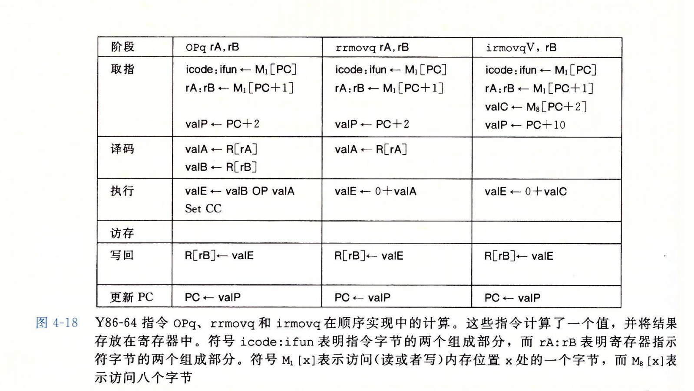
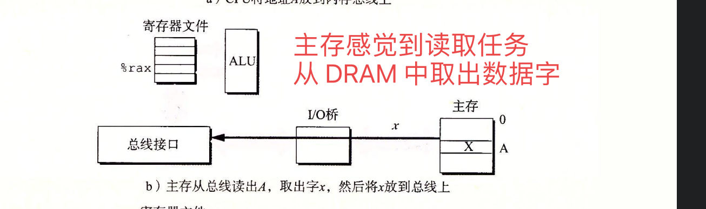
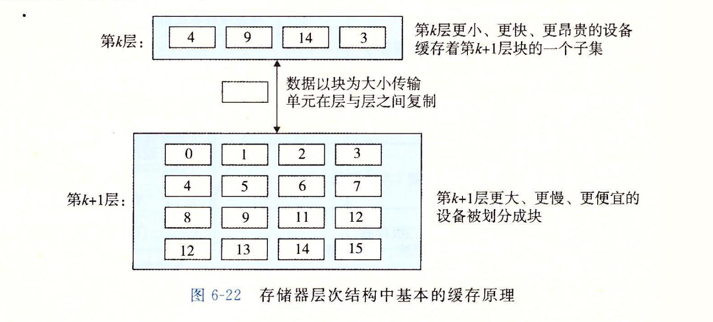

# 4 处理器体系结构


一些概念介绍

定义简单的指令集名字为 y86-64

* 与x86-64 相比，简洁很多


## 4.1 Y86-64 指令集体系结构

当我们定义指令集的时候，需要关注

* 各种状态单元
* 指令集
* 他们的编码
* 编程规范
* 异常事件处理


Y86-64采用 虚拟地址来引用内存位置

* 操作系统和硬件像 MMU 将虚拟地址翻译为实际 / 无力地址
* 同时注意， Stat 表示的是程序状态，说明是否有异常等等


### 4.1.2 Y86-64 指令


同时注意 对于每个指令的编码

* 第一个字节表示 指令的类型
    * 高四位是代码部分
    * 低四位是功能部分


> **Register**


* 当采需要寄存器，就用寄存器 ID 进行访问
* 如果不需要，就使用 F


当然所有整数采用 little edian， 当指令按照反汇编格式书写， 这些字节会按照相反的顺序出现

```shell
比如
rmmovq %rsp, 0x123456789abcd(%rdx)

rrmovq -> 40
$rsp -> 4
$rdx -> 2
40 42 
同时偏移量编码放到 8字节的常数字中，0x123456789abcd变成
00 01 23 45 67 89 ab cd
按照字节反序整体就是

40  | 42 | cd ab 89 67 45 23 01 00
```


### 4.1.4 Y86-64 异常


* 值为1， 代表 AOK
* 2， HLT， 说明处理器执行了 HALT
* 3， ADR 说明处理器 试图从一个非法内存地址读取或者写入
* 4 INS 说明非法指令


**X86 和 Y86 类似，都是由 GCC 编译器产生， 但是有一些不同点**

* Y86-64 将常数加载到寄存器中，因为它在算术指令中不能使用立即数

* 要实现从内存中读取一个数并加寄存器，Y86 需要两条， x86只需要一条

    * addq ($rdi), \$rax
    * 
    * mrmovq (%rdi), r10
    * addq %r10, %rax

    


### 4.1.6 一些 Y86-64 指令的详情

* pushq 会把栈指针减8
    * 并且将一个寄存器中的值写入内存
* popq 就加8

当然有歧义，到底是先 pu sh %rsp, 还是 push %rsp - 8?

实际上不同型号的处理器会有不同的处理，因此降低了代码的可移植性


## 4.2 逻辑设计和硬件控制语言 HCL

要实现一个数字系统主要需要三个主要的组成部分

* 计算对位进行操作的函数的组合逻辑
* 存储位的存储器单元
* 控制存储器单元更新的时钟信号


>  **HDL Hardware Description Language**

用来描述硬件，常用语言是 Verilog / VHDL


### 4.2.2 组合电路和HCL 布尔表达式

将很多逻辑门组合起来，就能构建计算块吗称为组合电路

* 每个逻辑门的输入必须由以下几个提供
    * 系统输入
    * 某个存储器单元的输出
    * 某个逻辑门的输出
* 两个或多个逻辑门的输出不能链接在一起，否则会使线上的信号矛盾
* 这个回路必须无环


比如

```cpp
bool eq = (a && b) || (!a && !b)
```


### 4.2.5 存储器和时钟

* 组合电路本质来说， 不存储任何信息， 只是简单地响应输入信号，产生等于输入的某个函数的输出
    * 为了产生时序电路，也就是有状态并且在这个状态上进行计算的系统， 我们必须引入能够按照位存储的设备

可以用寄存器存储，也可以用内存存储


## 4.3 Y86-64顺序实现

首先我们定义一个 SEQ 的处理器

* 每个时钟周期上， SEQ 执行处理一条完整指令所需要的所有步骤
    * 那么 instruction per cycle  始终是1


**4.3.1 将处理组织成截断**

分为这么几步

* 取指 Fetch
* 译码 Decode
* 执行 Exectute
* 访存
* 写回 Write Back
* 更新 PC PCupdate


在设计硬件的时候， 一个非常简单而一致的结构是非常重要的

* 其中一个方法降低复杂度是 让不同的指令共享尽可能多的硬件





### 4.3.2 SEQ 硬件结构


# 5 程序性能优化


**How to write an efficient Program**

* Select appropriate algorithms and data structures
    * 合适的数据结构和算法
* Capabilities and Limitations of Optimizing Compilers
    * 编译器的能力和局限性
* Exploiting Paralleism
    * 探索并行化
    
    

**研究程序的汇编代码表示是理解编译器以及产生的代码会如何运行的最有效手段之一**


## 5.1 编译器无法做的一些优化


用命令行 -Og 调用 gcc 可以实现基本优化

```shell
-O1 或者 -O2 会让它进行更大量的优化
虽然可以进一步提升程序性能，但是 与源代码的差距越来越大
```


```cpp
void add1(long *xp, long *yp){
  *xp += *yp;
  *xp += *yp;
}

void add2(long *xp, long *yp){
  *xp += 2 * *yp;
}

虽然 add1 需要 6 次引用内存， 2次读xp 2次读 yp 2次写xp
    add2 需要 3 次引用内存， 1次读xp 1次读 yp 1次写xp
  效率add2 高
看起来两个程序完成功能一致，但是如果 xp 和 yp 指向同一内存位置， 结果就会不一样
  	xp 一个变成4倍 一个变成3倍
  
  
 所以这种情况下，编译器无法进行优化
```


* 因为编译器不知道具体情况，所以它会假设两个指针有存在同一个指向的情况

再比如

```cpp
x = 1000; y = 3000;
*q = y;
*p = x;
t1 = *q
  
  那么如果 p q 指向的是同一位置
  t1 就可能是1000
```

* t1的计算值依赖于指针 p和q是否指向同一位置
* 这就造成了一个主要的妨碍优化的因素
* 如果编译器不能确定两个指针是否指向同一位置， 那么就必须假设都有可能发生


```cpp
long counter = 0;
int  fun(){
  return counter++;
}

int func1(){
  return fun() + fun() + fun() + fun();
  
  // 0 + 1 + 2 + 3;
}

int func2(){
  return 4 * func();
	//4 * 0
}

所以这种情况也不能进行优化
```


## 5.2 如何表示程序性能


比如计算前缀和

```cpp
For a vector a = [a0, a1, a2....an-1]
prefixSum    p = [p0, p1, p2.....pn-1]

void psum1(float a[], float p[], long n){
  long i = 0;
  p[0] = a[0];
  for(i = 1; i < n; i++)
    	p[i] = p[i - 1] + a[i];	//每次迭代计算一个元素的值
}


//这种效率高一些
//我们将这种技术称为循环展开 loop unorlling
void psum2(float a[], float p[], long n){
  long i = 0;
  p[0] = a[0];
	for(i = 1; i < n - 1; i += 2){
    float mid_val = p[i - 1] + a[i];
    p[i] = mid_val;
    p[i + 1] = mid_val + a[i + 1];	//也就是每次计算两个
  }
}
```


为了评估上述函数， 引入 CPE 每个元素执行所需要的周期数 cycle per element

* 可以帮我们理解迭代性能的理解
* psum1 的 CPE 为 9.0
* psum2 的 CPE 为 6.0
* 我们应该集中精力优化这部分性能


## 5.3 程序示例


定义一个结构体

> **向量抽象数据类型实现， 在实际程序中， data_t can be declared as int, long , float, doubel**

```cpp
typedef struct{
  long len;
  data_t* data;
} vec_rec, *vec_ptr;
```


```cpp
vec_ptr new_vec(long len){
  vec_ptr result = (vec_ptr) malloc(sizeof(vec_rec));
  data_t* data = NULL;
  
  if(!result)		//分配失败
    return NULL;
  
  result->len = len;
  if(len > 0){
    data = (data_t*) calloc(len, sizeof(data_t));
    if(!data){
      free(result);
      return NULL;		//分配失败
    }
  }
  
  result->data = data;
  return result;
}


//吧 data里面的数值取出来放到 ddest 中
int get_vec_element(vec_ptr v, long index, data_t* dest){
  if(index < 0 || index >= v->len)
    	return 0;
  *dest = v->data[index];
}

long vec_length(vec_ptr v){
  return v->len;
}
```


考虑下面的函数

```cpp
#define IDENT 0
#define OP +

void combine1(vec_ptr v, data_t* dest){
  long i;
  *dest = IDENT;
  for(int i = 0; i < vec_length(v); i++){
    data_t val;
    get_vec_element(v, i, $val);
    *dest = *dest OP val;
  }
}
```


## 5.4 消除循环的低效率


> **如果有可能写成常量，一定要这么写**


这里替换成 length, where lenght = vec_length(v);


> **注意函数调用**

假设有个函数想这么写

```cpp
void lower1(char* s){
  long i;
  for(i = 0; i < strlen(s); i++)
    if(s[i] >= 'A' && s[i] <= 'Z')
      s[i] -= ('A' - 'a');
}

size_t strlen(const char* s){
  long length = 0;
  while(*s != '\0'){
    s++;
    length++;
  }
  
  return length;
}

由于 每次for里面调用 strlen 
  整体时间复杂度为 O(N^2)
```

* 因为如果我们想优化，必须把它提出


我们把刚才这种低效率称为

* asymptotic inefficiency


## 5.5 减少过程调用


可以理解为 push / pop 都会有影响


## 5.6 消除不必要的内存引用


通过查看 combine3 的code

```cpp
void combine3(vec_ptr v, data_t* dst){
  long i;
  long length = vec_length(v);
  data_t* data = get_vec_start(v);
  
  *dest = IDENT;
  for(i = 0; i < length; i++){
    *dest = *dest OP data[i];
  }
}
```


注意到 每次循环开始， 都要从内存中读取值

```assembly
vmovsd (%rbx), %xmm0

vmovsd %xmm0, (%rbx) 最后写会内存
```


但实际上，我们刚刚才取出来这个值，然后又要再写进去。属实浪费

可以用个变量acc先存着，最后再写入内存

```cpp
void combine4(vec_ptr v, data_t* dest){
  long i;
  long length = vec_length(v);
  data_t* data = get_vec_start(v);
  data_t acc=  IDENT;
  
  for(i = 0; i < length; i++){
    acc = acc OP data[i];
  }
  
  *dest = acc;
}
```


## 5.7 理解现代处理器

两种下界 描述程序的最大性能

> **latency bound**

it is encountered when a series of operations must be performed in strict sequence, because the result of one operation is required before the next one can begin

* 这种界限会限制处理器的性能 尤其 exploit instruction-level parallelism

> **Throughtput bound**

characterizes the raw computing capacity of the procesor's functional units.

* This bound becomes the ultimate limit on program performance


## 5.8 循环展开


> **定义**

循环展开是一种程序变换， 通过增加每次迭代计算的元素的数量，减少循环的迭代次数


```cpp
void psum2(float a[], float p[], long n){
  long i = 0;
  p[0] = a[0];
	for(i = 1; i < n - 1; i += 2){
    float mid_val = p[i - 1] + a[i];
    p[i] = mid_val;
    p[i + 1] = mid_val + a[i + 1];	//也就是每次计算两个
  }
}
```


## 5.9 提高并行性


可以采用循环展开


**也可以采用重新结合变换**

```cpp
acc = (acc OP data[i]) OP data[i + 1];

  
acc = acc OP (data[i OP data[i + 1]]);
```


这种效率会有提升，编译器可以做到的优化更多


当然注意， 循环并行的好处会受到 汇编代码描述计算能力的限制

* 如果我们的并行度 p 超过了可用的寄存器数量， 那么编译器会 spilling， 将某些值放到内存中， 通常在运行的时候在堆/栈上分配空间


## 5.12 加载的性能

一个包含加载操作的程序性能， 既依赖于流水线的能力， 也依赖于加载单元的延迟

* 如果要确定一台机器上加载操作的延迟， 我们可以使用链表

```cpp
typedef struct ELE{
  struct ELE* next;
  long data;
} list_ele, *list_ptr;

long list_len(list_ptr ls){
  long len = 0;
  while(ls){
    len++;
    ls = ls->next;
  }
  
  return len;
}
```


换成汇编指令后

```assembly
.L3:
	addq $1, %rax				increament len
	movq (%rdi), %rdi		ls = ls->next		注意这里，要访问内存把东西拿出来
	testq %rdi, %rdi		test ls
	jen .L3							if nonnull, goto look
```


## 5.13  确认和消除性能平静下来


要想确定到底哪里慢了，可以采用

```shell
linux> gcc -Og -pg prog.c -o prog

-pg profiling 程序剖析
```


然后正常运行程序， 

调用 GPROF 来分析

```shell
linux > gprof prog
```


包含程序调用次数， 耗费时间


# 6 存储器的层次结构


## 6.1 存储技术

随机访问存储器分为两类

* 静态的 SRAM
* 动态的 DRAM

静态的 RAM 比 动态的贵，快


动态 RAM 对干扰十分敏感

* 数码照相机和摄像机中的传感器本质就是 DRAM 单元的阵列


传送的是两个地址， 出来的是8位数据


当然注意， 如果断电 SRAM 和 DRAM 都会丢失信息

* ROM 是非易失存储器


> **访问主存**

* 数据流通过 总线 bus 的共享电子电路在处理器和 DRAM 主存之间来回
* 每次 CPU 和 主存之间的数据传送都是通过一系列的步骤完成的
* 这些步骤称为总线事物


总线是一组并行的导线， 能携带地址，数据，和控制信号。


这个操作就是

```assembly
movq A, $rax   将地址A的内容加载到 寄存器中
```

* 





```assembly
movq %rax, A
有三个步骤
首先 CPU 将地址放到系统总线上， 内存从内存总线中读取地址， 并等待数据到达
然后 CPU 将$rax 中的数据字 复制到系统总线
最后主存从内存总线中读出数据，并存储到 DRAM中
```


### 6.1.2 磁盘存储


一些硬件知识，跳过


### 6.1.6 访问磁盘

CPU 使用 一种称为 内存映射 I/O 的技术向 I/O 设备发射命令


* 在磁盘控制器收到来自 CPU的读取命令时候，它将逻辑块号翻译成一个扇区地址
* 读取该扇区的内容，然后将内容直接传送到 主存， 不需要 CPU的干涉
* 设备可以自己执行读或者写总线事物而不需要CPU干预叫做 直接内存访问(direct memory access)


## 6.2 局部性

局部性通常有两种不同形式

* 时间局部性
    * 被引用过一次的内存位置很有可能在将来被多次引用
* 空间局部性
    * 如果一个内存位置被引用一次
    * 那么程序很有可能在不远的将来引用附近的一个内存位置


> **有良好局部性的程序比局部性差的程序运行的更快**

* 现代计算机系统的各个层次，从硬件到操作系统，再到应用程序
* 他们的设计都采用了局部性
    * 硬件层面，采用高速缓存存储器 来保留指令和数据项
    * 在操作系统， 允许系统使用主存作为虚拟地址空间最近被引用快的告诉缓存


### 6.2.2 取指令的局部性


代码区别于程序数据的一个重要属性是运行时不能进行修改，当程序正在执行的时候， CPU 只从内存中读取出它的指令， 很少会重写或者修改指令


**对局部性小结**

* 重复引用相同变量的程序有良好的时间局部性
* 对于步长 K的引用模式的程序，步长越小，空间局部性越好
* 对于取指令来说， 循环具有良好的时间 / 空间局部性
    * 循环体越小， 循环迭代次数越多， 局部性越好


## 6.3 存储器的层次结构


### 6.3.1 存储器层次结构的缓存





**缓存不命中的种类**

* 如果第k层的缓存是空的，那么对所有数据对象的访问都会不命中
    * 一个空的缓存有时被称为 冷缓存 cold cache


## 6.4 高速缓存存储器


早期计算机系统的存储器层次结构有三层

* CPU 寄存器
* DRAM 主存储器
* 磁盘存储


但是随着 CPU 和 DRAM 之间的gap逐渐增大

* 系统设计者被迫在 CPU 寄存器文件和主存之间插入小的 SRAM 高速缓存存储器


考虑这样一个计算机系统， 每个存储器地址有m位， 形成 2^m 地址

所有块的容量$C = S * E * B$


寻找过程先通过 无符号数找到 S， 然后匹配 t


### 6.4.2 直接映射高速缓存

每个组只有一行的高速缓存称为 直接映射高速缓存


举个具体的例子有关于直接映射高速缓存

```shell
(S, E, B, m) = (4, 1, 2, 4)
```


* 标记位和索引位连起来唯一标识内存中的每个块
    * 比如 块 0 由 标记位 0 和 索引位 共同标记
* 因为有8个内存快，但是只有4个高速缓存组，因此会有多个块映射到同一个组
    * 比如 0 和 4 都会被映射到 00
    * 映射到同一个高速缓存组的块由标记位唯一标识
    * 比如块0的标记位 0， 块 4 的标记位1


### 6.4.3 组相联高速缓存

直接映射高速缓存的冲突就是因为只有每个组只有一行

* 组相连的话就是说一组有几个


因为每个组可能有很多行，因此当我们匹配到对应的组

* 需要组内每一行进行标记位匹配


### 6.4.4 全相连高速缓存


只有一组


* 地址被划分为一个标记和一个块偏移


### 6.4.5 有关写的问题

我们看到 读取的时候很简单

* 有的话就从缓存中读取

* 没有的话，就从底层中拿到字w的块，然后存储到某个高速缓存行中

    


**写的情况就比较复杂了**

如果我们已经在高速缓存中更新了 它的副本，怎么在低层进行更新？

* 一种方法称为 直写 wirte-througth
    * 虽然简单，但是比较占用总线流量
* 另外一种方法就是 wirte back
    * 会尽可能推迟更新
    * 只有当替换算法要驱逐这个块的时候才会写回
    * 缺点是增加了复杂性， 高速缓存必须为每个高速缓存行维护一个额外 dirty bit


> **另外一个问题就是如何处理写不命中**

一种方法是 写分配 write-allocate

* 加载相应的的低一层中的块到高速缓存中，然后更新这个高速缓存块

另外一种方式是 非写分配

* 避开高速缓存，直接写到低一层


现在的趋势是使用写回 write-back


## 6.5 编写高速缓存友好的代码


注意两点

* 对局部变量的反复引用是好事， 因为编译器能够将他们缓存到寄存器文件中
* 步长位1的引用模式是好的，因为存储器层次结构中，所有层次上的缓存数据都是将数据存储为连续 块


# 7


