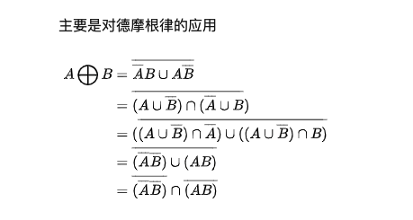

# Data Lab


> **参考资料**

```shell
1. https://www.zhihu.com/column/c_1325107476128473088
2. https://wdxtub.com/csapp/thick-csapp-lab-1/2016/04/16/
3. http://claude-ray.com/2019/10/02/csapp-datalab/
4. https://www.jianshu.com/p/a8912830ace8
```


```shell
docker exec -it e8b86bc3e544 /bin/bash
```


docker ps -a 可以看到之前运行过的记录， 有时候会停了

那么使用 `docker start container id`

然后再进去


# 1 bitXor


根据 得摩根定律




```cpp
```


# 2 tmin


```shell
1 << 31
```


# 3 isTmax


```cpp
a = 01111111111 
  
a + 1 = 1000000000
  ~(a + 1) = 011111111
  a ^ (~(a+1)) == 0 ? 1 : 0  // ^
 
a = 1111111111
  000000
!!((~a) ^ 0x) = 0
  
  !!1231 = 1
  !! -1   = 1
  !! 0    = 0
  
  
  1111111...01    res != 0
```


```shell
}
//2
/*
 * isTmax - returns 1 if x is the maximum, two's complement number,
 *     and 0 otherwise
 *   Legal ops: ! ~ & ^ | +
 *   Max ops: 10
 *   Rating: 1
 */
int isTmax(int x) {
	return !((~(x+1))^x) && !!(x+1);
}

比如 0111
那么 + 1 就变成 1000 取非就变成 0111 自己
那么可以看看自己和自己是不是 相同，可以用亦或

最后注意 -1 的特例
```


# AllOddBits

```cpp
31 30 29 28 27 。。。。。 1 0
  
  1 3 5 7 9 -》 1
  
  4 -> 1010 -> A
  
  (num & A) ^ (A) != 0    1010
	1000 & A = 1000 ^ A
  
  4 -> 8 -> 16 -> 32
  
  Tmin  1000000
```


# 4 isAsciiDigit


```shell
0x30 
0x39
  x
  110000
  111001
  return !cond1 & cond2
  
  cond1 ->  前面都是0
  	x >>= 6;
  	cond1 = !!x
  		x = 0, !!x  = 0
  		x = !0, !!x = 1
  		
  cond2 -> 11XXXX
  	x >>= 4;
  	(x ^ 0b11) == 0 ? 1 : 0
  	!(x ^ 0b11)
  	
  ---  00000000000 .. 26  
  			11XXXX
  	int c= x & 0xF
  	d = c - A < 0
  	!!(d >>= 31)
```


```shell
x <= y ? 1 : 0
  
  1. x == y 1
  	 int cond1 = !(x^y);
	
	signX = x >> 31 & 1;
	signY = y >> 31 & 1;
	2. x + y -
		int cond2 = (!signX & signy); //1
	3. x - y+
		int cond3 = signX & (!signY) //1
		
	4. x - y - x+ y +
	x - y
	x + ~y + 1
	int con4 = (x + ~y + 1) >> 31 & 1
return cond1 | (!cond2 && (cond3 || (con4)))
```


```cpp
//3
/*
 * isAsciiDigit - return 1 if 0x30 <= x <= 0x39 (ASCII codes for characters '0' to '9')
 *   Example: isAsciiDigit(0x35) = 1.
 *            isAsciiDigit(0x3a) = 0.
 *            isAsciiDigit(0x05) = 0.
 *   Legal ops: ! ~ & ^ | + << >>
 *   Max ops: 15
 *   Rating: 3
 */
int isAsciiDigit(int x) {
        int a = !(x >> 4 ^  0x3);
        int b = x&0xF;
        int c = ~0xA+1;
        int e = 1 << 31;
        int d = !!((b+c)&e);
        return a & d;
}
思路是 观察 
  				0x110000  0x30
  				0x111001	0x39
  
 必须证明你开头是0x110000
 那么通过右移动4位和0x3 异或，如果是1， 那么没问题，如果不是，那么说明不相等

 现在确定了 数字的形式是 0x11XXXX
  那么就拿剩下的数字 - A, 如果发现是负数，那么false
  				判断负数就判断最高位
```


# 5 conditional


```cpp
/*
	很好考虑， 一定是类似
	(m op y) | (m op z)的形式
	也就是说 m = 1 取前面的
				  m = 0 取后面的
*/
int conditional(int x, int y, int z) {
    int m = ~(!x) + 1;
    return (~m & y) | (m&z);

}
```


# 6 isLessOrEqual


```cpp
/*
 * isLessOrEqual - if x <= y  then return 1, else return 0
 *   Example: isLessOrEqual(4,5) = 1.
 *   Legal ops: ! ~ & ^ | + << >>
 *   Max ops: 24
 *   Rating: 3
 */
int isLessOrEqual(int x, int y) {
        int equal = !(x ^ y);
        int signX = (x >> 31) & 0x1;
        int signY = (y >> 31) & 0x1;

        //x neg, y pos
        int con1 = signX & (!signY);
        //x pos, y neg
        int con2 = (!signX) & (signY);

        int sameSign = !(signX ^ signY);
        int res = x + (~y) + 1;
        int sign = (res >> 31) & 0b1;
        return equal | ((!con2) & (con1 | (sign & sameSign)));
}	if

//思路首先是
如果x <0, y > 0一定没问题
  然后如果想等，那么也没问题
  接下来就是确保 x > 0 y < 0 这种情况不会发生 通过 !a
  	然后确认符号位 为 -1
```


# 7 Logical Negative


**C**/C++**语言中**逻辑**右移**和**算数右移**共享同一个运算符 >> 。 编译器决定使用逻辑**右移**还是**算数右移**，根据的**是**运算数的类型。 如果运算数类型**是** unsigned 则采用逻辑**右移**，而 signed 则采用**算数右移**


```cpp
/*
 * logicalNeg - implement the ! operator, using all of
 *              the legal operators except !
 *   Examples: logicalNeg(3) = 0, logicalNeg(0) = 1
 *   Legal ops: ~ & ^ | + << >>
 *   Max ops: 12
 *   Rating: 4
 */
int logicalNeg(int x) {
        int negX = ~x + 1;
        return ((x | negX) >> 31) + 1;
}

需要考虑 0 和 正负数的区别
					-x
 x = 0		0
 x = +		-
 x = -		+
  
  那么如果 逻辑或并且 算数右移动，非0的数字一定可以拿到 11111111111, which is -1
  那么就可以和 0 区分开了
```


# 8 howMantBits


```cpp
/*
		递归的思想
		temp = x     if x > 0
					-x + 1 if x < 0
					
        1100 0010 1000 1100 1001 1111 1011 0101
        0011
        
        16 + 8 + 4 + 2 + 
        
     这个题目不好理解
     首先 temp = x 自身 当 x 为正数
     对于负数特别复杂
     
     因为比如 -1的32位表示 0xFF FF FF FF FF
     但是它要求 minimum number to represent
     0b1 这样也可以表示负数 -1
     不一定是二进制表示
*/
int howManyBits(int x) {
    int temp=x^(x>>31);//get positive of x;
    int isZero=!temp;
    //notZeroMask is 0xffffffff
    int notZeroMask=(!(!temp)<<31)>>31;
    int bit_16,bit_8,bit_4,bit_2,bit_1;
    bit_16=!(!(temp>>16))<<4; //主要算得是最低16位是否存在
    //see if the high 16bits have value,if have,then we need at least 16 bits
    //if the highest 16 bits have value,then rightshift 16 to see the exact place of
    //if not means they are all zero,right shift nothing and we should only consider the low 16 bits
    temp=temp>>bit_16;
    bit_8=!(!(temp>>8))<<3;
    temp=temp>>bit_8;
    bit_4=!(!(temp>>4))<<2;
    temp=temp>>bit_4;
    bit_2=!(!(temp>>2))<<1;
    temp=temp>>bit_2;
    bit_1=!(!(temp>>1));
    temp=bit_16+bit_8+bit_4+bit_2+bit_1+2;
  	//at least we need one bit for 1 to tmax,
    //and we need another bit for sign
  //这里之所以 + 除了 sign 以外的另外一个1，主要是因为 比如数字1
  //除了本身的1，还有个符号为，必须算， bit_1 算不了这部分的值， bit_1 算得是这部分的值
  	0xFFFFFFFF
      |
      1111
      | 这个F里面的这个1
    return isZero|(temp&notZeroMask);
}
```


# 9 FloatScale2


```cpp
//float
/*
 * floatScale2 - Return bit-level equivalent of expression 2*f for
 *   floating point argument f.
 *   Both the argument and result are passed as unsigned int's, but
 *   they are to be interpreted as the bit-level representation of
 *   single-precision floating point values.
 *   When argument is NaN, return argument
 *   Legal ops: Any integer/unsigned operations incl. ||, &&. also if, while
 *   Max ops: 30
 *   Rating: 4
 */

这个题目就是针对不同的浮点数，进行不同的处理
unsigned floatScale2(unsigned uf) {
        unsigned sign = (uf >> 31);
        unsigned exp  = (uf & 0x7f800000) >> 23;
        unsigned frac = (uf & 0x7FFFFF);

  	//如果是 小数 / 非规格化数字
        if(exp == 0){
                return (sign << 31) | (frac << 1);
        }else if(exp == 0xFF){ // 无穷大
                return uf;
        }else{	//正经数字  当然如果overflow 就 overflow 因为没有能再表示的数字了
                exp++;
                return (sign << 31) | (exp << 23) | (frac);
        }


}
```


# 10 

```cpp
//按照自己思路更新一版本
int floatFloat2Int(unsigned uf) {
        unsigned sign = uf >> 31;
        unsigned expr = (uf & 0x7F800000) >> 23;
        unsigned man = (uf & 0x7FFFFF);

        //if zero
        if(expr == 0x0 && man == 0x0){
                return 0;
        }

        //if NaN or infinity
        if(expr == 0xFF){
                return 1 << 31;
        }

        //if denomalize
        if(expr == 0x00){
                return 0;
        }

        if(uf == 0x80000000){
                int c = 0;
        }
        //if nomarlize
        man = man | (1 << 23);
        int E = expr - 127;
        if(E < 0){
                return 0;
        }
        if(E > 31){
                return 1 << 31;
        }

        if(E >= 23){
                man <<= (E - 23);
        }else{
                man >>= (23 - E);
        }

        if((man >> 31) == 1) // too big
                return 1 << 31;
        if(sign == 1){
                int res = ~man + 1;
                return res;
        }

        return man;
}
```


```cpp
1110011111101111000000
  
00000000001110011111101111000000
  sign 0
  exp 011 1111 1
  mantissa
	  000 0000 0000 0000 0000 0000
```


```cpp
int floatFloat2Int(unsigned uf) {
        unsigned sign = (uf >> 31);
        unsigned exp  = (uf & 0x7f800000) >> 23;
        unsigned frac = (uf & 0x7FFFFF) | (0x800000); //这里之所以要 加1是因为有规格化数

        int E = exp - 127;

  	//如果本身就是 0， 那么就返回
  //或者 E < 0, 因为 M 1.xx 或者 0.xxx 那么 必然为0 
        if((!(uf & 0x7FFFFFFF)) || E < 0)
                return 0;       //0

  		// 2^32 overflow
        if(E > 31)
                return (1 << 31);

  	// 看看小数点在数字左边还是右边
        if(E < 23){
                frac >>= (23 - E); 1.0101 * 2^3 如果 E = 3
                  							//  我们拿到的 frac 实际上是 10101
                                  // 相当于现在 frac 有 24位， 要被扣掉几位， 就看E的能力了， 如果E大， 扣的就少
        }else{
                frac <<= (E - 23);//1.0101 * 2 ^30
          												//10101000 需要右移动7位
        }

        if( !((frac >> 31) ^ sign)){
                return frac;
        }else if(frac >> 31){
                return 1 << 31;
        }else{
                return ~frac + 1;
        }
}
```


# 11


```cpp
0000 0000 1000 0000 0000 0000 0000 0000
  								最小值					最大值
	非规格化数				2^-126*2-23			2-126(2^-1 + 2^-2 ++ .... 2^-23)
  规格化数				2^-126					2^127
  
   */
unsigned floatPower2(int x) {
        if(x < -149){ // number is too small
                return 0;
        }else if(x < -126){	//非规格化数的最小值
                int shift = x + 149;
                return 1 << shift;
        }else if(x <= 127){//规格化数
                int exp = x + 127;
                return exp << 23;
        }else{//巨几把大的数字 直接返回 INF
                unsigned res = 0xFF;
                return res << 23;

        }
}
~
```


# 完整版答案


> **bits.c**

```c
/*
 * CS:APP Data Lab
 *
 * <Please put your name and userid here>
 *
 * bits.c - Source file with your solutions to the Lab.
 *          This is the file you will hand in to your instructor.
 *
 * WARNING: Do not include the <stdio.h> header; it confuses the dlc
 * compiler. You can still use printf for debugging without including
 * <stdio.h>, although you might get a compiler warning. In general,
 * it's not good practice to ignore compiler warnings, but in this
 * case it's OK.
 */

#if 0
/*
 * Instructions to Students:
 *
 * STEP 1: Read the following instructions carefully.
 */

You will provide your solution to the Data Lab by
editing the collection of functions in this source file.

INTEGER CODING RULES:

  Replace the "return" statement in each function with one
  or more lines of C code that implements the function. Your code
  must conform to the following style:

  int Funct(arg1, arg2, ...) {
      /* brief description of how your implementation works */
      int var1 = Expr1;
      ...
      int varM = ExprM;

      varJ = ExprJ;
      ...
      varN = ExprN;
      return ExprR;
  }

  Each "Expr" is an expression using ONLY the following:
  1. Integer constants 0 through 255 (0xFF), inclusive. You are
      not allowed to use big constants such as 0xffffffff.
  2. Function arguments and local variables (no global variables).
  3. Unary integer operations ! ~
  4. Binary integer operations & ^ | + << >>

  Some of the problems restrict the set of allowed operators even further.
  Each "Expr" may consist of multiple operators. You are not restricted to
  one operator per line.

  You are expressly forbidden to:
  1. Use any control constructs such as if, do, while, for, switch, etc.
  2. Define or use any macros.
  3. Define any additional functions in this file.
  4. Call any functions.
  5. Use any other operations, such as &&, ||, -, or ?:
  6. Use any form of casting.
  7. Use any data type other than int.  This implies that you
     cannot use arrays, structs, or unions.


  You may assume that your machine:
  1. Uses 2s complement, 32-bit representations of integers.
  2. Performs right shifts arithmetically.
  3. Has unpredictable behavior when shifting if the shift amount
     is less than 0 or greater than 31.


EXAMPLES OF ACCEPTABLE CODING STYLE:
  /*
   * pow2plus1 - returns 2^x + 1, where 0 <= x <= 31
   */
  int pow2plus1(int x) {
     /* exploit ability of shifts to compute powers of 2 */
     return (1 << x) + 1;
  }

  /*
   * pow2plus4 - returns 2^x + 4, where 0 <= x <= 31
   */
  int pow2plus4(int x) {
     /* exploit ability of shifts to compute powers of 2 */
     int result = (1 << x);
     result += 4;
     return result;
  }

FLOATING POINT CODING RULES

For the problems that require you to implement floating-point operations,
the coding rules are less strict.  You are allowed to use looping and
conditional control.  You are allowed to use both ints and unsigneds.
You can use arbitrary integer and unsigned constants. You can use any arithmetic,
logical, or comparison operations on int or unsigned data.

You are expressly forbidden to:
  1. Define or use any macros.
  2. Define any additional functions in this file.
  3. Call any functions.
  4. Use any form of casting.
  5. Use any data type other than int or unsigned.  This means that you
     cannot use arrays, structs, or unions.
  6. Use any floating point data types, operations, or constants.


NOTES:
  1. Use the dlc (data lab checker) compiler (described in the handout) to
     check the legality of your solutions.
  2. Each function has a maximum number of operations (integer, logical,
     or comparison) that you are allowed to use for your implementation
     of the function.  The max operator count is checked by dlc.
     Note that assignment ('=') is not counted; you may use as many of
     these as you want without penalty.
  3. Use the btest test harness to check your functions for correctness.
  4. Use the BDD checker to formally verify your functions
  5. The maximum number of ops for each function is given in the
     header comment for each function. If there are any inconsistencies
     between the maximum ops in the writeup and in this file, consider
     this file the authoritative source.

/*
 * STEP 2: Modify the following functions according the coding rules.
 *
 *   IMPORTANT. TO AVOID GRADING SURPRISES:
 *   1. Use the dlc compiler to check that your solutions conform
 *      to the coding rules.
 *   2. Use the BDD checker to formally verify that your solutions produce
 *      the correct answers.
 */


#endif
//1
/*
 * bitXor - x^y using only ~ and &
 *   Example: bitXor(4, 5) = 1
 *   Legal ops: ~ &
 *   Max ops: 14
 *   Rating: 1
 */
int bitXor(int x, int y) {
	return ~(~x&~y)&~(x&y);
}
/*
 * tmin - return minimum two's complement integer
 *   Legal ops: ! ~ & ^ | + << >>
 *   Max ops: 4
 *   Rating: 1
 */
int tmin(void) {
  return 1 << 31;

}
//2
/*
 * isTmax - returns 1 if x is the maximum, two's complement number,
 *     and 0 otherwise
 *   Legal ops: ! ~ & ^ | +
 *   Max ops: 10
 *   Rating: 1
 */
int isTmax(int x) {
	return !((~(x+1))^x) & !!(x+1);
}
/*
 * allOddBits - return 1 if all odd-numbered bits in word set to 1
 *   where bits are numbered from 0 (least significant) to 31 (most significant)
 *   Examples allOddBits(0xFFFFFFFD) = 0, allOddBits(0xAAAAAAAA) = 1
 *   Legal ops: ! ~ & ^ | + << >>
 *   Max ops: 12
 *   Rating: 2
 */
int allOddBits(int x) {
	int a = 0xAA << 8;
	int c = a | 0xAA;
	int d = c << 16 | c;
	return !((x & d) ^ d);
}
/*
 * negate - return -x
 *   Example: negate(1) = -1.
 *   Legal ops: ! ~ & ^ | + << >>
 *   Max ops: 5
 *   Rating: 2
 */
int negate(int x) {
  return ~x + 1;
}
//3
/*
 * isAsciiDigit - return 1 if 0x30 <= x <= 0x39 (ASCII codes for characters '0' to '9')
 *   Example: isAsciiDigit(0x35) = 1.
 *            isAsciiDigit(0x3a) = 0.
 *            isAsciiDigit(0x05) = 0.
 *   Legal ops: ! ~ & ^ | + << >>
 *   Max ops: 15
 *   Rating: 3
 */
int isAsciiDigit(int x) {
        int a = x >> 6;
        int b = !(a ^ 0);       //if high bits are zero, b = 1, else b = 0;
        int c = !((x >> 4) ^ (0b11));	//	看看是不是11XXXX格式

        int remains = x & 0xF;
        int minus = remains + ~(0xA) + 1;
        return b & c & !((minus >> 31) + 1);//确保 比A小

}
/*
 * conditional - same as x ? y : z
 *   Example: conditional(2,4,5) = 4
 *   Legal ops: ! ~ & ^ | + << >>
 *   Max ops: 16
 *   Rating: 3
 */
int conditional(int x, int y, int z) {
    int m = ~(!x) + 1;
    return (~m & y) | (m&z);

}
/*
 * isLessOrEqual - if x <= y  then return 1, else return 0
 *   Example: isLessOrEqual(4,5) = 1.
 *   Legal ops: ! ~ & ^ | + << >>
 *   Max ops: 24
 *   Rating: 3
 */
int isLessOrEqual(int x, int y) {
	int msbX = x >> 31;
	int msbY = y >> 31;
	int a    = ((!msbX) & msbY); // x+, y-
	int b    = (msbX & (!msbY));//  x-, y+
	int res = x + (~y + 1);
	return b | (!a & (res >> 31)) | (!(x^y));
}
//4
/*
 * logicalNeg - implement the ! operator, using all of
 *              the legal operators except !
 *   Examples: logicalNeg(3) = 0, logicalNeg(0) = 1
 *   Legal ops: ~ & ^ | + << >>
 *   Max ops: 12
 *   Rating: 4
 */
int logicalNeg(int x) {
	int negX = ~x + 1;
	return ((x | negX) >> 31) + 1;
}
/* howManyBits - return the minimum number of bits required to represent x in
 *             two's complement
 *  Examples: howManyBits(12) = 5
 *            howManyBits(298) = 10
 *            howManyBits(-5) = 4
 *            howManyBits(0)  = 1
 *            howManyBits(-1) = 1
 *            howManyBits(0x80000000) = 32
 *  Legal ops: ! ~ & ^ | + << >>
 *  Max ops: 90
 *  Rating: 4
 */
int howManyBits(int x) {
	int temp = x^(x>>31);
	int isZero = !temp;	// 1 if temp = 0, else 0

	//oxffffffff
	int nonZeroMask = ((!!temp) << 31) >> 31;// logical shift
	int bit_16, bit_8, bit_4, bit_2, bit_1;

	bit_16 = (!!(temp >> 16)) << 4;	//at least we need 16 bits in the lower level

	temp >>= bit_16;

	bit_8 = (!!(temp >> 8)) << 3;

	temp >>= bit_8;

	bit_4 = (!!(temp >> 4)) << 2;

	temp >>= bit_4;

	bit_2 = (!!(temp >> 2)) << 1;

	temp >>= bit_2;
	bit_1 = (!!(temp >> 1)) << 0;//(!!(temp >> 1)) << 0;

	temp = bit_16 + bit_8 + bit_4 + bit_2 + bit_1 + 2;

	return isZero | (temp & nonZeroMask);
}
//float
/*
 * floatScale2 - Return bit-level equivalent of expression 2*f for
 *   floating point argument f.
 *   Both the argument and result are passed as unsigned int's, but
 *   they are to be interpreted as the bit-level representation of
 *   single-precision floating point values.
 *   When argument is NaN, return argument
 *   Legal ops: Any integer/unsigned operations incl. ||, &&. also if, while
 *   Max ops: 30
 *   Rating: 4
 */
unsigned floatScale2(unsigned uf) {
        unsigned sign = (uf >> 31);
        unsigned exp  = (uf & 0x7f800000) >> 23;
        unsigned frac = (uf & 0x7FFFFF);

	if(exp == 0){
		return (sign << 31) | (frac << 1);
	}else if(exp == 0xFF){
		return uf;
	}else{
		exp++;
		return (sign << 31) | (exp << 23) | (frac);
	}


}
/*
 * floatFloat2Int - Return bit-level equivalent of expression (int) f
 *   for floating point argument f.
 *   Argument is passed as unsigned int, but
 *   it is to be interpreted as the bit-level representation of a
 *   single-precision floating point value.
 *   Anything out of range (including NaN and infinity) should return
 *   0x80000000u.
 *   Legal ops: Any integer/unsigned operations incl. ||, &&. also if, while
 *   Max ops: 30
 *   Rating: 4
 */
int floatFloat2Int(unsigned uf) {
        unsigned sign = (uf >> 31);
        unsigned exp  = (uf & 0x7f800000) >> 23;
        unsigned frac = (uf & 0x7FFFFF) | (0x800000);

	int E = exp - 127;

	if((!(uf & 0x7FFFFFFF)) || E < 0)
		return 0;	//0

	if(E > 31)
		return (1 << 31);

	if(E < 23){
		frac >>= (23 - E);
	}else{
		frac <<= (E - 23);
	}

	if( !((frac >> 31) ^ sign)){
		return frac;
	}else if(frac >> 31){
		return 1 << 31;
	}else{
		return ~frac + 1;
	}
}
/*
 * floatPower2 - Return bit-level equivalent of the expression 2.0^x
 *   (2.0 raised to the power x) for any 32-bit integer x.
 *
 *   The unsigned value that is returned should have the identical bit
 *   representation as the single-precision floating-point number 2.0^x.
 *   If the result is too small to be represented as a denorm, return
 *   0. If too large, return +INF.
 *
 *   Legal ops: Any integer/unsigned operations incl. ||, &&. Also if, while
 *   Max ops: 30
 *   Rating: 4
 */
unsigned floatPower2(int x) {
	if(x < -149){
		return 0;
	}else if(x < -126){
		int shift = x + 149;
		return 1 << shift;
	}else if(x <= 127){
		int exp = x + 127;
		return exp << 23;
	}else{
		unsigned res = 0xFF;
		return res << 23;

	}
}
```


```cpp
a 011111111111 + 1

b 1000000000000

  
  ~b  ^  a == 0
a 111111111      a + 1 == 0
  	a + 1   000000000
  ~ 111111
```


```cpp
12 -> 01100 -> 0 + 1100
  
  if x == 0
    	return 1
   else{x
     	1000 0000  0010 0000 | 0000 0000 0000 0000    
        x >>= 16
   }

11011 => -1 
 111 => -1
  11 => -1
   1 => -1
  
 x => ~x + 1
  
  1111
  0000 + 1 = 1
  
  1111111111111100 =
  100 = -4
  0011 + 1 = 100 -> 1 + 3 = 
```


# 另一版答案


```cpp
/*
 * CS:APP Data Lab
 *
 * Wenchao Guo, wg83
 *
 * bits.c - Source file with your solutions to the Lab.
 *          This is the file you will hand in to your instructor.
 *
 * WARNING: Do not include the <stdio.h> header; it confuses the dlc
 * compiler. You can still use printf for debugging without including
 * <stdio.h>, although you might get a compiler warning. In general,
 * it's not good practice to ignore compiler warnings, but in this
 * case it's OK.
 */

#if 0
/*
 * Instructions to Students:
 *
 * STEP 1: Read the following instructions carefully.
 */

You will provide your solution to the Data Lab by
editing the collection of functions in this source file.

INTEGER CODING RULES:

  Replace the "return" statement in each function with one
  or more lines of C code that implements the function. Your code
  must conform to the following style:

  int Funct(arg1, arg2, ...) {
      /* brief description of how your implementation works */
      int var1 = Expr1;
      ...
      int varM = ExprM;

      varJ = ExprJ;
      ...
      varN = ExprN;
      return ExprR;
  }

  Each "Expr" is an expression using ONLY the following:
  1. Integer constants 0 through 255 (0xFF), inclusive. You are
      not allowed to use big constants such as 0xffffffff.
  2. Function arguments and local variables (no global variables).
  3. Unary integer operations ! ~
  4. Binary integer operations & ^ | + << >>

  Some of the problems restrict the set of allowed operators even further.
  Each "Expr" may consist of multiple operators. You are not restricted to
  one operator per line.

  You are expressly forbidden to:
  1. Use any control constructs such as if, do, while, for, switch, etc.
  2. Define or use any macros.
  3. Define any additional functions in this file.
  4. Call any functions.
  5. Use any other operations, such as &&, ||, -, or ?:
  6. Use any form of casting.
  7. Use any data type other than int.  This implies that you
     cannot use arrays, structs, or unions.


  You may assume that your machine:
  1. Uses 2s complement, 32-bit representations of integers.
  2. Performs right shifts arithmetically.
  3. Has unpredictable behavior when shifting if the shift amount
     is less than 0 or greater than 31.


EXAMPLES OF ACCEPTABLE CODING STYLE:
  /*
   * pow2plus1 - returns 2^x + 1, where 0 <= x <= 31
   */
  int pow2plus1(int x) {
     /* exploit ability of shifts to compute powers of 2 */
     return (1 << x) + 1;
  }

  /*
   * pow2plus4 - returns 2^x + 4, where 0 <= x <= 31
   */
  int pow2plus4(int x) {
     /* exploit ability of shifts to compute powers of 2 */
     int result = (1 << x);
     result += 4;
     return result;
  }

FLOATING POINT CODING RULES

For the problems that require you to implement floating-point operations,
the coding rules are less strict.  You are allowed to use looping and
conditional control.  You are allowed to use both ints and unsigneds.
You can use arbitrary integer and unsigned constants. You can use any arithmetic,
logical, or comparison operations on int or unsigned data.

You are expressly forbidden to:
  1. Define or use any macros.
  2. Define any additional functions in this file.
  3. Call any functions.
  4. Use any form of casting.
  5. Use any data type other than int or unsigned.  This means that you
     cannot use arrays, structs, or unions.
  6. Use any floating point data types, operations, or constants.


NOTES:
  1. Use the dlc (data lab checker) compiler (described in the handout) to
     check the legality of your solutions.
  2. Each function has a maximum number of operations (integer, logical,
     or comparison) that you are allowed to use for your implementation
     of the function.  The max operator count is checked by dlc.
     Note that assignment ('=') is not counted; you may use as many of
     these as you want without penalty.
  3. Use the btest test harness to check your functions for correctness.
  4. Use the BDD checker to formally verify your functions
  5. The maximum number of ops for each function is given in the
     header comment for each function. If there are any inconsistencies
     between the maximum ops in the writeup and in this file, consider
     this file the authoritative source.

/*
 * STEP 2: Modify the following functions according the coding rules.
 *
 *   IMPORTANT. TO AVOID GRADING SURPRISES:
 *   1. Use the dlc compiler to check that your solutions conform
 *      to the coding rules.
 *   2. Use the BDD checker to formally verify that your solutions produce
 *      the correct answers.
 */


#endif
//1
/*
 * bitXor - x^y using only ~ and &
 *   Example: bitXor(4, 5) = 1
 *   Legal ops: ~ &
 *   Max ops: 14
 *   Rating: 1
 */
int bitXor(int x, int y) {
	return (~((~x)&(~y))) & (~(x&y));
}
/*
 * tmin - return minimum two's complement integer
 *   Legal ops: ! ~ & ^ | + << >>
 *   Max ops: 4
 *   Rating: 1
 */
int tmin(void) {
    int a = 1;
    return a << 31;

}
//2
/*
 * isTmax - returns 1 if x is the maximum, two's complement number,
 *     and 0 otherwise
 *   Legal ops: ! ~ & ^ | +
 *   Max ops: 10
 *   Rating: 1
 */
int isTmax(int x) {
       int tmin = ~0;
        int c = x + 1;

	int res = (c^tmin);

	if(x == ((1 << 31) - 1)){
		printf("res = %d\n", res);
		printf("!res = %d\n", !res);
		int ans = !res;
		printf("ans = %d\n", ans);
	}
	return !res;
}
/*
 * allOddBits - return 1 if all odd-numbered bits in word set to 1
 *   where bits are numbered from 0 (least significant) to 31 (most significant)
 *   Examples allOddBits(0xFFFFFFFD) = 0, allOddBits(0xAAAAAAAA) = 1
 *   Legal ops: ! ~ & ^ | + << >>
 *   Max ops: 12
 *   Rating: 2
 */
int allOddBits(int x) {
	int A = 0xA;
	int B = (A << 4) | A;	//0xAA
	int C = (B << 8) | B;	//0xAAAAA
	int D = (C << 16) | C; 	// 0xAAAAAAAA

	return !((x & D) ^ D);
}
/*
 * negate - return -x
 *   Example: negate(1) = -1.
 *   Legal ops: ! ~ & ^ | + << >>
 *   Max ops: 5
 *   Rating: 2
 */
int negate(int x) {
  return ~x + 1;
}
//3
/*
 * isAsciiDigit - return 1 if 0x30 <= x <= 0x39 (ASCII codes for characters '0' to '9')
 *   Example: isAsciiDigit(0x35) = 1.
 *            isAsciiDigit(0x3a) = 0.
 *            isAsciiDigit(0x05) = 0.
 *   Legal ops: ! ~ & ^ | + << >>
 *   Max ops: 15
 *   Rating: 3
 */
int isAsciiDigit(int x) {
  	int a = x >> 6;
	int b = !(a ^ 0);	//if high bits are zero, b = 1, else b = 0;
	int c = !((x >> 4) ^ (0b11));

	int remains = x & 0xF;
	int minus = remains + ~(0xA) + 1;
	return b & c & !((minus >> 31) + 1);

}
/*
 * conditional - same as x ? y : z
 *   Example: conditional(2,4,5) = 4
 *   Legal ops: ! ~ & ^ | + << >>
 *   Max ops: 16
 *   Rating: 3
 */
int conditional(int x, int y, int z) {
	int expr = !!x; // x != 0 => x = 1, x = 0 => x = 0
	int tmin = 1 << 31;
	int mask = (tmin >> 31) + expr;
	return ((~mask) & y) | (mask & z);
}
/*
 * isLessOrEqual - if x <= y  then return 1, else return 0
 *   Example: isLessOrEqual(4,5) = 1.
 *   Legal ops: ! ~ & ^ | + << >>
 *   Max ops: 24
 *   Rating: 3
 */
int isLessOrEqual(int x, int y) {
	int equal = !(x ^ y);
	int signX = (x >> 31) & 0x1;
	int signY = (y >> 31) & 0x1;

	//x neg, y pos
	int con1 = signX & (!signY);
	//x pos, y neg
	int con2 = (!signX) & (signY);

	int sameSign = !(signX ^ signY);
	int res = x + (~y) + 1;
	int sign = (res >> 31) & 0b1;
	return equal | ((!con2) & (con1 | (sign & sameSign)));
}
//4
/*
 * logicalNeg - implement the ! operator, using all of
 *              the legal operators except !
 *   Examples: logicalNeg(3) = 0, logicalNeg(0) = 1
 *   Legal ops: ~ & ^ | + << >>
 *   Max ops: 12
 *   Rating: 4
 */
int logicalNeg(int x) {
	int negX = ~x + 1;
	return ((negX | x) >> 31) + 1;
}
/* howManyBits - return the minimum number of bits required to represent x in
 *             two's complement
 *  Examples: howManyBits(12) = 5
 *            howManyBits(298) = 10
 *            howManyBits(-5) = 4
 *            howManyBits(0)  = 1
 *            howManyBits(-1) = 1
 *            howManyBits(0x80000000) = 32
 *  Legal ops: ! ~ & ^ | + << >>
 *  Max ops: 90
 *  Rating: 4
 */
int howManyBits(int x) {
	int flag = x >> 31;
	x = (~flag & x) | (flag & (~x));

	int bit_16, bit_8, bit_4, bit_2, bit_1, bit_0;
	bit_16 = (!!(x >> 16)) << 4;
	x >>= bit_16;
	bit_8 = (!!(x >> 8)) << 3;
	x >>= bit_8;
	bit_4 = (!!(x >> 4)) << 2;
	x >>= bit_4;
	bit_2 = (!!(x >> 2)) << 1;
	x >>= bit_2;
	bit_1 = (!!(x >> 1)) << 0;
	x >>= bit_1;
	bit_0 = x;

	return 1 + bit_16 + bit_8 + bit_4 + bit_2 + bit_1 + bit_0;
}
//float
/*
 * floatScale2 - Return bit-level equivalent of expression 2*f for
 *   floating point argument f.
 *   Both the argument and result are passed as unsigned int's, but
 *   they are to be interpreted as the bit-level representation of
 *   single-precision floating point values.
 *   When argument is NaN, return argument
 *   Legal ops: Any integer/unsigned operations incl. ||, &&. also if, while
 *   Max ops: 30
 *   Rating: 4
 */
unsigned floatScale2(unsigned uf) {
	unsigned sign = uf >> 31;
	unsigned expr = (uf & 0x7F800000) >> 23;
	unsigned man = (uf & 0x7FFFFF);

	// numer is 0
	if(expr == 0x0 && man == 0x0){
		return uf;
	}

	//number is not a number of is NaN
	if(expr == 0xFF){
		return uf;
	}

	//if is denomarzie
	if(expr == 0x0){
		return (sign << 31) | (man << 1);
	}

	//if it is normalize
	expr++;
	return (sign << 31) | (expr << 23) | man;
}
/*
 * floatFloat2Int - Return bit-level equivalent of expression (int) f
 *   for floating point argument f.
 *   Argument is passed as unsigned int, but
 *   it is to be interpreted as the bit-level representation of a
 *   single-precision floating point value.
 *   Anything out of range (including NaN and infinity) should return
 *   0x80000000u.
 *   Legal ops: Any integer/unsigned operations incl. ||, &&. also if, while
 *   Max ops: 30
 *   Rating: 4
 */
int floatFloat2Int(unsigned uf) {
        unsigned sign = uf >> 31;
        unsigned expr = (uf & 0x7F800000) >> 23;
        unsigned man = (uf & 0x7FFFFF);

	//if zero
	if(expr == 0x0 && man == 0x0){
		return 0;
	}

	//if NaN or infinity
	if(expr == 0xFF){
		return 1 << 31;
	}

	//if denomalize
	if(expr == 0x00){
		return 0;
	}

	if(uf == 0x80000000){
		int c = 0;
	}
	//if nomarlize
	man = man | (1 << 23);
	int E = expr - 127;
	if(E < 0){
		return 0;
	}
	if(E > 31){
		return 1 << 31;
	}

	if(E >= 23){
		man <<= (E - 23);
	}else{
		man >>= (23 - E);
	}

	if((man >> 31) == 1) // too big
		return 1 << 31;
	if(sign == 1){
		int res = ~man + 1;
		return res;
	}

	return man;
}
/*
 * floatPower2 - Return bit-level equivalent of the expression 2.0^x
 *   (2.0 raised to the power x) for any 32-bit integer x.
 *
 *   The unsigned value that is returned should have the identical bit
 *   representation as the single-precision floating-point number 2.0^x.
 *   If the result is too small to be represented as a denorm, return
 *   0. If too large, return +INF.
 *
 *   Legal ops: Any integer/unsigned operations incl. ||, &&. Also if, while
 *   Max ops: 30
 *   Rating: 4
 */
unsigned floatPower2(int x) {
if(x < -149){
return 0;
}else if(x < -126){ // denormalize
int shift = 23 - (-126 - x);
return (1 << shift);
}else if(x <= 127){
int E = x + 127;
return E << 23;
}else{
return 0xFF << 23;
}
}


  0 01111111 000 0000 0000 0000 0000 0000
```


```c
/* howManyBits - return the minimum number of bits required to represent x in
 *             two's complement
 *  Examples: howManyBits(12) = 5   0 + 1100
 *            howManyBits(298) = 10
 *            howManyBits(-5) = 4
 *            howManyBits(0)  = 1
 *            howManyBits(-1) = 1
 *            howManyBits(0x80000000) = 32
 *  Legal ops: ! ~ & ^ | + << >>
 *  Max ops: 90
 *  Rating: 4

		1110001 => -1
		111  => -1
		11   => -1
		1    => -1
		if(x == 0)
			return 1;
     else {
     		x > 0
     			1 + highBit		//0100
     		x  < 0
     			111110001
     }
 */
int howManyBits(int x) {
	int isZero = !!x;
 	int flag = x >> 31;
  x = ((~flag) & x) | (flag & (~x)));	//get the highest bits
  
  0000 0000 0000 0000 | 0000 0000 0000 0000
    
  0000 0100 0000 0000 | 0000 0000 0000 0000
  int bit_16, bit_8, bit_4, bit_2, bit_1, bit_0;
  bit_16 = (!((!!(x >> 16)) ^ 0x1)) << 4;  //0  16
	x >>= bit_16;
  
  bit_8 = (!((!!(x >> 8)) ^ 0x1)) << 3;  //0  16
	x >>= bit_8;
  
  bit_4 = (!((!!(x >> 4)) ^ 0x1)) << 2;  //0  16
	x >>= bit_16;
  
   bit_2 = (!((!!(x >> 2)) ^ 0x1)) << 1;  //0  16
	x >>= bit_2;
  
     bit_1 = (!((!!(x >> 1)) ^ 0x1)) ;  //0  16
	x >>= bit_1;
  x = bit_0;
  int res =  + 1;
	return isZero | ();
}
```


```cpp
另外一种更好理解的方法
int floatFloat2Int(unsigned uf) {
        unsigned s = (uf >> 31) & (0b1);
        unsigned expr = (uf >> 23) & (0xFF);
        unsigned man  = (uf & 0x7FFFFF) | (1 << 23);

        //0
        if(expr == 0 && man == 0){
                return 0;
        }

        //NaN or Infinity
        if(expr == 0xFF){
                return 1 << 31;
        }

        //denormalize
        if(expr == 0x0){
                return 0;
        }

        //normalize
        int E = expr - 127;
        if(E > 31)
                return 1 << 31;
        else if(E < 0)
                return 0;

        if(E >= 23){
                man <<= (E - 23);
        }else{
                man >>= (23 - E);
        }

        if(s)
                return ~man + 1;
        return man;
}
```

